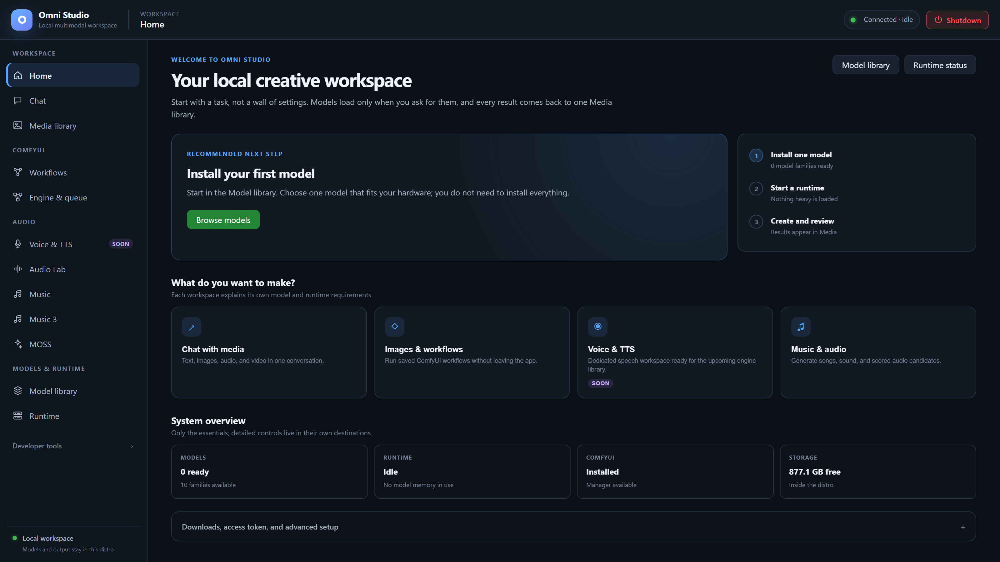

# Portable Omni Server

**A Linux distro for local AI, with the Omni Studio desktop workspace.**

> [!IMPORTANT]
> **Portable Omni Server is a Linux distro. Windows users must install WSL2
> and enable hardware virtualization.** The desktop window also requires
> Microsoft WebView2. CPU-capable workloads can run without an NVIDIA GPU;
> CUDA workloads require a compatible NVIDIA GPU and Windows driver with WSL
> support. Python is included in the portable release.

Maintained by [aivrar](https://github.com/aivrar).

The distro and Windows launcher were built from my
[portable-linux-in-a-box](https://github.com/aivrar/portable-linux-in-a-box)
project. Omni Studio adds the local AI workspace, gateway and model tools.

Omni Studio is a local multimodal workspace packaged as a Windows application
with a dedicated WSL2 Linux distro. The Windows window talks to a local bridge
and gateway; models, workflows, and generated media live inside that distro.



*The live Home page in its idle setup state. Browse the
[screenshot gallery](manual/screenshots.md) for every workspace.*

## Your local workspace

- **Chat:** local model sessions with model-specific text, image and audio input.
- **ComfyUI:** workflow import, requirements checks, GPU placement and queue controls.
- **Music and audio:** ACE-Step, Audio Lab and Music 3 workspaces, plus MOSS sound effects.
- **Media library:** browse, play, organize and export saved results.
- **Model library and Runtime:** install models, select devices and manage workers.
- **CLI and API:** automate the same local studio from scripts and other clients.

Models, workflows and generated media are stored inside the Linux distro.
Choose the engines and weights needed for your work. See
[feature compatibility](manual/21-feature-compatibility.md) for supported
modalities, engine requirements and task-specific behavior.

## Windows requirements

| Requirement | Purpose |
| --- | --- |
| 64-bit Windows 11, or Windows 10 21H2 or later | Windows host for the launcher and WSL GPU workloads |
| WSL2 and hardware virtualization | Runs the Linux distro |
| Microsoft WebView2 Runtime | Displays the desktop workspace |
| Free disk space | Holds the growing Linux disk, model downloads and generated media |
| Internet access for downloads and updates | Obtains the release image, model weights and optional components |

**CPU or GPU:** the workspace and CPU-capable workflows can run on CPU.
CPU generation can be much slower and needs enough system RAM. A compatible
NVIDIA GPU and Windows driver enable CUDA acceleration; some models and
custom nodes specifically require CUDA. Check the selected engine's
[compatibility requirements](manual/21-feature-compatibility.md).

**Python is already included.** The Linux image contains Python and the model
environments. The Windows package also contains an embedded Python under
`runtime/python/` for its networking relay. Neither requires a separate Python
installation on the user's PC.

Install WSL from **PowerShell as Administrator**, then restart Windows:

```powershell
wsl --install
```

After restarting, check `wsl --status`. See Microsoft's
[WSL installation guide](https://learn.microsoft.com/en-us/windows/wsl/install)
and [GPU setup guide](https://learn.microsoft.com/en-us/windows/wsl/tutorials/gpu-compute).
Omni Studio uses its own distro named `linbox-Omni_Studio`.

Download the Windows package from [Releases](https://github.com/aivrar/Portable_Omni_Server/releases/latest).
Extract it, run `Prepare-Omni.cmd` to download and verify the preinstalled Linux
image, then launch `Omni_Studio.exe`. Keep the app folder together. Model weights
are selected and downloaded inside the app. Follow
[Launch and first run](manual/02-launch-and-first-run.md).
The GitHub source checkout contains the application code and documentation;
the Windows launcher binaries, Linux runtime image and model weights are
separate package components. See [package contents](docs/portability.md).

## Start here

- [GitHub wiki](https://github.com/aivrar/Portable_Omni_Server/wiki): the full
  illustrated operator manual with page navigation.
- [Usage manual](manual/README.md): launching the packaged app, each UI tab,
  the CLI, GPU placement, shutdown, and feature compatibility.
- [API capability inventory](docs/api-capability-inventory.md): route families
  and authentication. The typed request models in `server/routers/` are the
  exact request contract.
- [Feature compatibility](manual/21-feature-compatibility.md): model inputs,
  engine-specific requirements and supported tasks.
- [Repository layout](docs/repository-layout.md): source and local runtime
  locations.
- [Development guide](docs/development.md): source setup and focused checks.

## Source layout

| Path | Role |
|---|---|
| `server/` | Gateway, workers, setup, and browser UI |
| `cli/`, `omni-cli`, `omni-cli.bat` | API command-line client and launchers |
| `comfy_nodes/` | Omni-owned ComfyUI extension |
| `manual/`, `docs/`, `skills/` | Operator, API, and agent guidance |
| `tests/`, `test_assets/` | Regression tests and reusable fixtures |
| `bridge.py`, `bridge_watchdog.py`, `windows_loopback_relay.py`, `app.json` | Local launcher contracts |
| `reports/` | Dated investigation records, including the repository audit |

## License and acknowledgements

Original project code is available under the [MIT license](LICENSE). See
[third-party and media terms](THIRD_PARTY_NOTICES.md). Unreviewed binary fixture
and report media remains local and is excluded from the default Git release.
Reviewed app screenshots are included under `manual/images/`; their captions,
capture details, and asset hashes are linked from the screenshot gallery.
