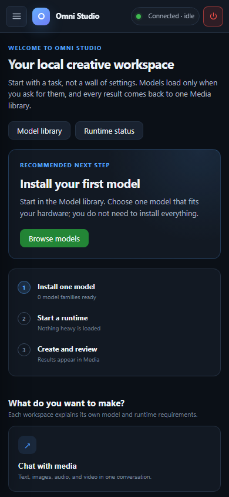

# Launch and first run

This page is the physical Windows path: keep the folder together, start
`Omni_Studio.exe`, wait for the Linux distro, and recognize the window chrome
before you click Chat.

## Before you double-click

1. Confirm the host matches [What Omni Studio is](01-what-omni-studio-is.md):
   **Windows 11 or Windows 10 21H2 or later**, **WSL2**, **WebView2**, and
   **disk headroom** on the drive that holds the app. A compatible NVIDIA GPU
   and Windows driver are needed for CUDA workloads; CPU-capable workloads
   can use the CPU. Python is included in the release.
2. Confirm the folder still contains `Omni_Studio.exe`, `webview.dll`,
   `app.json`, `bridge.py`, `bridge_watchdog.py`, `runtime/`, and `linux/`.
   The preinstalled-image import creates `ext4.vhdx` beside the executable.
   Older bootstrap installations can use `wsl/ext4.vhdx` instead.
   **Keep the app folder together.**
3. If using a GPU, close other GPU-heavy apps. First-time WSL CUDA initialization
   can be slower when the card is already full.
4. If this PC has never used WSL, run `wsl --install` once as Administrator
   and reboot. Do not skip that reboot.

## Start the app

Download and extract the Windows ZIP from
[Releases](https://github.com/aivrar/Portable_Omni_Server/releases/latest).
Run `Prepare-Omni.cmd` once. It downloads the Linux image parts, verifies their
SHA-256 checksums, and joins them into `linux/rootfs.tar.gz`. The image already
contains the Linux dependencies; preparation does not install an AI stack from
the internet. Keep the terminal open until it says **Ready**.

For an offline transfer, download every `omni-rootfs-...tar.gz.001` (and following
numbered part) asset into `linux/parts/` beside the extracted app. Run
`Prepare-Omni.cmd -Offline` to verify and assemble them without network access.
The destination PC still needs WSL2 and WebView2, plus a compatible Windows
GPU driver if using CUDA workloads. Python is already included.
Model weights are downloaded separately through Model library.

**Do this:** in File Explorer, open the Omni Studio folder and double-click
`Omni_Studio.exe`.

**Then:** a native window opens. On a cold first launch the launcher imports
or starts the WSL distro `linbox-Omni_Studio`, runs the packaged setup when
needed, and starts the bridge at port 9200. The WebView loads the local UI.

First boot can take several minutes. Later launches are faster because the
VHDX already exists. A first GPU-using start (ComfyUI, a large worker) can
still spend extra minutes while WSL initializes the shared CUDA driver. That
delay is driver bring-up, not model download.

Windows registers the name `linbox-Omni_Studio` once per user. A second extracted
folder with the same app identity reuses that registration. Keep one active
installation folder; do not treat a second extraction as an independent studio
or overwrite an existing studio's disk.

*The browser content after connecting. This captures the app workspace, not the native Windows setup window.*

## What the top bar is telling you

### Brand

The left cluster reads **Omni Studio** with the subtitle "Local multimodal
workspace." That is the product, not a browser tab title you can ignore.

### Page context

Next to the brand, two lines track where you are:

- the **section** (Workspace, ComfyUI, Audio, Models & runtime, Developer tools)
- the **page title** (Home, Chat, Media library, and so on)

These update when you change sidebar destinations. They are the same labels
this manual uses.

### Gateway badge

The pill on the right starts as **Connecting...** while WebView2 waits for the
bridge and gateway. It turns into a connected/ready state once `/api/session`
succeeds.

If it stays on Connecting:

- wait through first-boot setup
- confirm WSL is running: `wsl -d linbox-Omni_Studio -- echo ok`
- do not click every destination hoping that loads models; nothing behind the
  UI works until the gateway answers
- check [Logs](16-logs.md) after it connects; the live stream is empty until
  then

The UI retries with a bounded backoff (about 1, 2, 4, then 8 seconds) and
reacquires the session token after a 401. A brief disconnect during a gateway
restart is normal. A stuck Connecting state after ten minutes is a host
problem (WSL, VHDX, antivirus locking the VHDX, missing WebView2).

### Shutdown button

The top-right **Shutdown** control unloads models, stops ComfyUI, cancels
jobs, and closes the Windows host. It is not "log out of chat." Read
[Shutdown](17-shutdown.md) before you use it mid-generation.

## Sidebar navigation

The left rail is the entire product map.

**Workspace**

- **Home** — status, HuggingFace token, recommended next step
- **Chat** — multimodal sessions
- **Media library** — every persisted result

**ComfyUI**

- **Workflows** — choose, verify, run graphs
- **Engine & queue** — start Comfy, watch the queue, manage nodes

**Audio**

- **Voice & TTS** — a reserved speech hub marked **Soon**. The MOSS page
  documents the separate speech controls and their decoder requirements.
- **Audio Lab** — Stable Audio + CLAP
- **Music** — ACE-Step songs
- **Music 3** — MiniMax Music 3
- **MOSS** — sound effects and speech-engine controls; see the MOSS page for
  speech-runtime compatibility.

**Models & runtime**

- **Model library** — downloads
- **Runtime** — devices, workers, API keys

**Developer tools** (collapsed `
` until you open it)

- **Testing** — one-shot load and prompt
- **Logs** — live SSE log

On a narrow window a hamburger button opens the same rail over a scrim.
Escape or the scrim closes it. Arrow keys move between tab buttons when one
is focused.

You can also jump by URL hash once the UI is up: `#chat`, `#media`,
`#workflows`, `#comfy`, `#tts`, `#audio-lab`, `#ace-step`, `#minimax-music3`,
`#moss`, `#models`, `#server`, `#testing`, `#log`, `#setup`. The app remembers
the last tab in browser storage.

The footer of the sidebar repeats the storage rule: **Local workspace — Models
and output stay in this distro.**

## First-run sequence that actually works

Do not try to generate on a blank install. Follow Home's three-step progress:

1. **Install one model** in [Model library](06-model-library.md) (or Home's
   advanced defaults). You do not need every family.
2. **Start a runtime** only when you are ready to use that model:
   - Chat model → spawn a worker on [Runtime](07-runtime.md) or from Chat
   - Images/video → start Comfy on [Engine & queue](09-engine-and-queue.md)
   - Music/audio → load the engine on its own tab
3. **Create and review** in Chat, Workflows, or an audio tab, then open
   [Media library](05-media-library.md)

If a gated HuggingFace repo is involved, save a token on Home **before** the
download. See [Jobs, tokens, composition, and media retrieval](20-jobs-huggingface-and-special-usages.md).

## Where the Linux work actually runs

`app.json` records:

- distro name `linbox-Omni_Studio`
- start command `/opt/omni_studio/venv/bin/python3 /opt/omni_studio/bridge.py`
- window size 1440×900
- a terminal affordance (`terminal: true`) so the launcher can expose a Linux
  shell for recovery

The Windows-facing API is `http://127.0.0.1:9200`. The in-distro gateway
default of 8200 is not the address you type in a Windows browser. If you open
Edge on Windows, use 9200, or stay inside the WebView.

## First-launch mistakes

- **Moving only the exe.** The distro disk and WebView2 library stay behind.
  Keep the app folder together.
- **Deleting `ext4.vhdx` because it looks large.** The registered disk, beside
  the executable or under `wsl/` in older installations, *is* your
  studio. Sparse size on disk can be smaller than the number Explorer shows.
- **Opening the UI and immediately starting Comfy, ACE-Step, Music 3, and a
  7B chat worker.** They fight for VRAM. Start one family, use it, unload it.
- **Treating Voice & TTS as ready because it is in the sidebar.** It is
  labelled Soon.
- **Assuming Chat attachments always work.** Qwen audio/video input and native
  speech output are not wired. Moshi is hidden from Chat because there is no
  usable batch/stream path.

## After a successful connect

You should see Home with:

- a recommended next step card
- counts of ready model families and active runtimes
- ComfyUI installed/not installed
- GB free inside the distro
- an advanced panel for HuggingFace and LoRAs

If Home renders but every count is zero, you have a working app and an empty
library. That is a good first-run state. Go to Model library.

## Related pages

- [Home](03-home.md)
- [Runtime](07-runtime.md)
- [Shutdown](17-shutdown.md)
- [Logs](16-logs.md)

## Narrow-window example

At this width the sidebar moves behind the hamburger button. Open it to
choose a destination; press Escape or click the dark scrim to close it.
