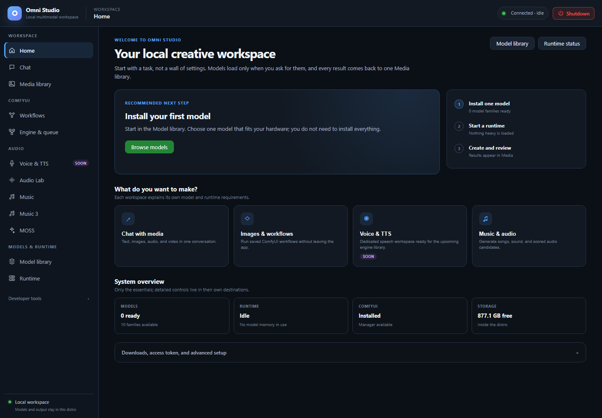

# Home

*Home recommends installing a model; the gateway is connected and idle. Captured September 25, 2026.*

Home is the first workspace destination. It is not a settings dump. It tells
you whether any model is installed, whether anything heavy is loaded, how much
disk remains inside the distro, and what to do next. Detailed installers live
on Model library and the audio tabs; Home only keeps the essentials plus an
advanced panel for downloads, the HuggingFace token, and LoRA adapters.

Open it from the sidebar: **Workspace → Home**. The page title reads Home.

## Read the page from top to bottom

### Heading and shortcuts

The heading is "Your local creative workspace." Two buttons jump away:

- **Model library** — install weights
- **Runtime status** — see GPUs and workers

Use those when you already know you need downloads or a spawn. Otherwise stay
on Home and follow the recommended next step.

### Recommended next step

Home computes one card from live state:

1. **If no chat/standalone model family is installed:** "Install your first
   model." The primary button is **Browse models**. Audio Lab and ACE-Step are
   excluded from this count because they install on their own tabs.
2. **If models are installed but nothing is running:** "Start a runtime when
   you are ready." Loading is explicit. The app stays light until you spawn a
   worker or start Comfy. The primary button is **Open Runtime**.
3. **If something is already running:** "Choose what you want to create." The
   primary button is **Open Chat**, and **View recent media** appears so you
   can skip straight to the library.

Trust this card. It is the same three-step progress drawn beside it:

1. Install one model
2. Start a runtime
3. Create and review — results appear in Media

You do not need to install everything. One family that fits the GPU is enough
to learn the rest of the UI.

### Destination cards

Four large buttons send you into a task, not a settings page:

| Card | Destination | Honest note |
|---|---|---|
| Chat with media | Chat | Text is the dependable path. Image works on verified Qwen/MiniCPM variants. Audio/video input is model-specific and often blocked. |
| Images & workflows | Workflows | Needs a ComfyUI engine before Run is enabled. Requirement checks still work while Comfy is stopped. |
| Voice & TTS | Voice & TTS | Marked **Soon**. Not a working synthesizer. |
| Music & audio | Music (ACE-Step) | Songs, not Chat. Load a DiT model on the Music tab. |

Each workspace explains its own model and runtime requirements after you
arrive. Home will not pre-download those models for you.

### System overview

Four readiness tiles:

- **Models** — how many standalone families are ready versus how many exist
- **Runtime** — idle, or a count of workers + Comfy instances
- **ComfyUI** — Installed / Not installed, and whether Manager is available
- **Storage** — GB free **inside the distro**

"Idle" is success when you are not generating. It means no model memory is in
use. Do not start runtimes "just in case."

## Advanced panel: downloads, access token, and setup

Open **Downloads, access token, and advanced setup**. Most operators only need
this once.

### Default downloads

**Install missing defaults** queues the baseline assets the app considers
required. The button is disabled when nothing is missing. When it is enabled,
Home also shows how many GB of defaults are still absent.

**Do this only** if you want the packaged baseline in one shot. Individual
models and variants still belong on Model library. Large checkpoints download
one at a time; watch **Install activity** on this same panel and the download
jobs table on Model library.

If disk headroom is too small, fix the host disk before retrying. The installer
will not magically compact the VHDX.

### HuggingFace access

Gated model cards (many official Stable Audio and some Omni checkpoints)
refuse anonymous download. Home shows one of:

- **Not connected** — no token saved. Only needed for gated downloads.
- **Connected** — signed in as a HuggingFace username
- **Needs attention** — the saved token was rejected
- **Not verified** — saved but the check could not complete

**Do this:**

1. Create a token at huggingface.co → Settings → Access Tokens. It starts with
   `hf_`.
2. Accept every gated model card **with the same account**.
3. On Home, paste the token into the password field and click **Save token**.
4. Wait for the badge to turn Connected.

Replace a rejected token the same way. The field is write-only; the UI will
not echo the secret back.

You can also save a token from the CLI (`omni-cli setup hf-token`) as
described in [Jobs, tokens, composition, and media retrieval](20-jobs-huggingface-and-special-usages.md).

### Optional LoRA adapters

A LoRA is a small adapter that restyles a compatible Omni chat model without
redownloading the base. Most users skip this until a workflow or a spawn form
asks for one.

**Search HuggingFace**

1. Type a query such as the model family name.
2. Press Enter or click **Search**.
3. Install from a result if the repo is the adapter you actually want.

**Install from a repository ID**

Open **Install from a repository ID**, paste `organization/repository`,
optionally give a local name, and click **Download**.

**Installed adapters** lists names, sizes, and whether the adapter file is
present. Pick one later on Runtime when spawning a compatible worker. Audio
engine LoRAs (ACE-Step packs) are **not** this list; those install on the
Music tab.

### Install activity

Downloads you start from Home appear here with job id, kind, target, status,
and a **Cancel** button while running. **Log** opens the installer output when
the job recorded any.

Statuses you will see: running, cancelling, completed, failed, cancelled.
Failed gated downloads usually mean the token is missing or the model card was
not accepted. Open the log, fix the account, save the token, retry once.

Polling rules for these jobs are in
[Jobs, tokens, composition, and media retrieval](20-jobs-huggingface-and-special-usages.md).
Do not confuse an install `job_id` with an ACE-Step output folder id.

## What Home will not do

- It will not spawn a worker. That is Runtime, Chat, Testing, or an audio tab.
- It will not start ComfyUI. That is Engine & queue (or the Runtime shortcut).
- It will not install Audio Lab / ACE-Step weights through a generic "Install
  base" path. Those engines have dedicated installers.
- It will not make Voice & TTS work. That card is Soon.

## Related pages

- [Model library](06-model-library.md)
- [Runtime](07-runtime.md)
- [Chat](04-chat.md)
- [Voice & TTS](10-voice-and-tts.md)
