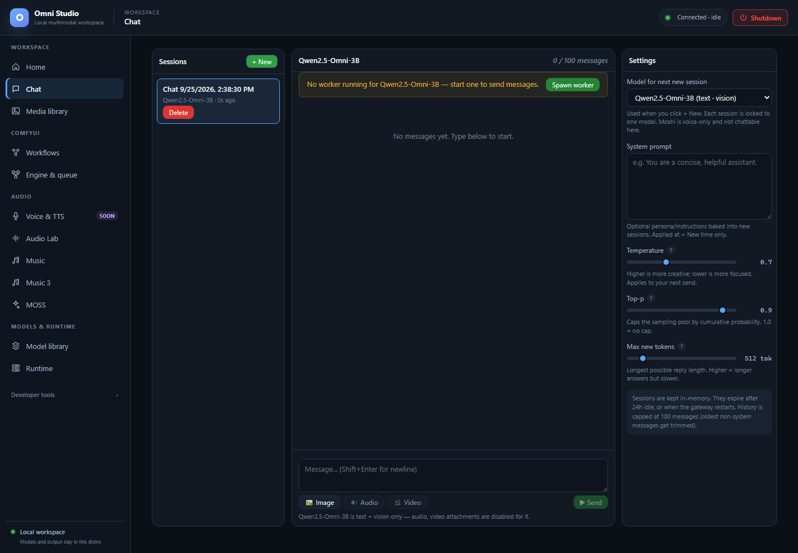

# Chat

*A new empty Qwen session. No worker is running; unsupported audio/video attachments are disabled. Captured September 25, 2026.*

Chat is the conversational workspace. It is a three-pane session UI over
persisted (in-memory) conversations: **Sessions** on the left, the **thread**
in the center, **Settings** on the right. It talks to a running Omni model
worker. If no worker is ready for the session's model, Send stays disabled
until you spawn one.

Open it from **Workspace → Chat**, from Home's Chat card, or from `#chat`.

Chat is not Music, not Audio Lab, and not ComfyUI. A song model cannot appear
here. Moshi is intentionally hidden because the session API cannot carry
full-duplex audio.

## Before you send anything

1. Install a chat-capable family on [Model library](06-model-library.md).
2. Prefer a variant that fits the GPU. Verified starting points:
   - Qwen2.5-Omni 3B text on a 12 GB card (it will fill the card)
   - Qwen2.5-Omni 7B GPTQ-int4 text/image on a 24 GB card
   - MiniCPM-o 2.6 text/image/audio **understanding** on a 24 GB card
3. Read [Feature compatibility](21-feature-compatibility.md) for the same family. Typed
   attachment buttons are not a capability guarantee.
4. Leave Music 3 / ACE-Step / a full Comfy graph unloaded if VRAM is tight.

## Create a session

**Do this:**

1. On the right, choose **Model for next new session**. The label includes a
   short capability hint such as `text · vision · audio`.
2. Optionally type a **System prompt**. It is baked in at creation time only.
   Changing the box later does not rewrite an open session.
3. Click **+ New**.

**Then:** a row appears in Sessions, the thread opens, and the compose box is
ready. The session is locked to that model. You cannot switch models inside an
existing thread; create another session.

If no models are available, the UI tells you to install one first. Audio Lab,
ACE-Step, MOSS-TTS, MOSS-SFX, and Moshi are not in this picker.

### Session list

Each row shows a title (or `Model · N msg`), the model display name, and
relative activity (`3m ago`). Click a row to open it. **Delete** asks for
confirmation and drops that history.

Sessions live in gateway memory. They expire after **24 hours idle**, they
die when the gateway restarts, and history is capped at **100 messages**
(oldest non-system messages are trimmed). This is not a cloud transcript and
not a file on disk.

## Spawn the worker when Chat asks

If the session's model has no ready worker, a warning banner appears above the
thread: "No worker running for … — start one to send messages." **Spawn
worker** calls the same default spawn path as Runtime.

**Do this:** click **Spawn worker** and wait. Cold loads can take a minute, and
MiniCPM-o on a busy host has taken several minutes. The banner changes to
"Starting worker…" while that runs. Send stays disabled.

**Then:** the banner clears, Send enables, and Runtime will show a ready
worker for that family.

If spawn fails, read the toast, check [Runtime](07-runtime.md) for VRAM, and
analyze placement as in [GPU placement](19-gpu-placement.md). Chat's one-click
spawn does not let you pick a UUID pool; use Runtime when you need an explicit
device, variant, LoRA, or precision.

Do not click Spawn repeatedly. One load is already expensive.

## Send a message

Type in the box. **Enter** sends. **Shift+Enter** inserts a newline. IME
composition (CJK candidate Enter) does not send.

**Send** streams the reply into the thread. Tokens appear as they arrive. A
**■ Abort** button appears during a stream; it cancels the job on the worker.

If streaming fails, Chat falls back to the non-streaming session message
route. Either way, the completed assistant turn is stored on the session.

### Attachments

Three buttons sit under the textarea: **Image**, **Audio**, **Video**. They
open a file picker for that media type. A chip appears above the box with the
filename and an ✕ to remove it. Attachments apply to the **next** send only.

Binary files are capped at about 14 MB so the base64 payload stays under the
gateway limit. Larger files fail with a toast before they are sent.

Buttons whose modality the **active** model cannot accept are disabled, with
an inline hint such as "MiniCPM-o is text + vision + audio only — video
attachment is disabled for it." Disabled buttons do nothing on click.

**Honest wiring (do not skip this):**

| Family | What Chat can actually use today |
|---|---|
| Qwen2.5-Omni 3B/7B | Text verified. Image verified on the 7B GPTQ and 3B (use a 24 GB card for image). **Audio and video input return 501** — not wired. Native speech output is not registered. |
| MiniCPM-o 2.6 | Text, image, and audio understanding verified. **Video is rejected.** Native TTS is blocked in the decoder. Send **one** input modality per request; image-plus-audio together is rejected. Raw audio is decoded to mono 16 kHz and limited to 60 seconds. |
| Qwen3-Omni / Nemotron 30B | Capacity hard-stop on typical 24+12 GB hosts. Audio/video 501 even if a future variant fits. |
| AnyGPT | Worker is text-only. Cold load has failed to become ready inside the bridge window. Do not treat it as a Chat target. |
| Moshi | Hidden from Chat. No usable batch or full-duplex stream path. |

If you attach audio to Qwen, the server will not silently ignore it. You get
an error. That is better than a fake success.

## Right-hand settings

These knobs apply to the **next send** (except model and system prompt, which
apply to the **next new session**):

- **Temperature** (0–2) — higher is more varied
- **Top-p** (0–1) — nucleus sampling cap; 1.0 is no cap
- **Max new tokens** (32–4096) — upper bound on the reply length

Values persist in local browser storage on this Windows profile.

## Switching sessions during a stream

If a reply is still streaming, selecting another session asks for
confirmation and aborts the in-flight job. Pending attachments are cleared so
they cannot leak into the other thread.

## Images in the thread

Assistant or user images render inline. Clicking an image opens it in a new
WebView/browser view. Durable files still belong in Media library; Chat
attachments are session payload, not a substitute for the output library.

## OpenAI-compatible clients

If you want Cursor, a Python `OpenAI()` client, or another tool to talk to the
same worker, use Runtime's **API access** card and
[Command-line interface](18-cli.md). Chat itself is the GUI for humans.

Loopback clients use `http://127.0.0.1:9200/v1`. Do not print the Omni API
token into logs.

## Related pages

- [Runtime](07-runtime.md) — pick device/variant/LoRA before spawn
- [Model library](06-model-library.md) — install the family first
- [Feature compatibility](21-feature-compatibility.md) — Moshi, Qwen audio/video, MiniCPM TTS
- [Testing](15-testing.md) — single-shot prompt without sessions
