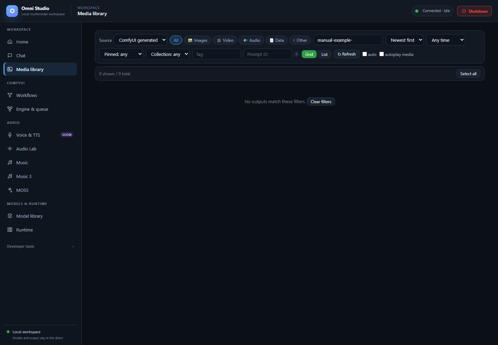

# Media library



*The filename prefix filter has no matches. Clear filters returns to the library; existing personal media is outside this capture. Captured September 25, 2026.*

Media library is the single place generated files come back to. Chat images
that were only attached in a session are not this library. ComfyUI outputs,
ACE-Step songs, Audio Lab clips, Music 3 WAVs, MOSS speech, and composed
masters are.

Open it from **Workspace → Media library**. The sidebar reminder is the rule:
models and output stay inside the distro; this page is how a Windows user
sees them.

## Sources

The **Source** dropdown chooses which Linux tree you are browsing:

| Source | What it is |
|---|---|
| **ComfyUI generated** (`output`) | Normal finished graphs. Start here. |
| **ComfyUI inputs** (`input`) | Files uploaded as workflow inputs. |
| **ComfyUI temp** (`temp`) | Intermediate/cache frames. Treat as disposable. |
| **Omni (TTS / STT)** (`omni`) | MOSS, ACE-Step, Audio Lab, Music 3, compositions |

If a song "vanished," you are probably still on ComfyUI generated. Switch to
**Omni (TTS / STT)**.

## Filter until the grid is small enough

Kind chips: **All**, **Images**, **Video**, **Audio**, **Data**, **Other**.

Other filters:

- **Filename starts with...** — prefix match, not full-text search inside PNG
  metadata
- **Newest first / Oldest first / Largest first / Name A→Z**
- **Any time / Last 24h / Last 7 days / Last 30 days**
- **Pinned: any / Pinned only / Unpinned only**
- **Collection: any** plus named collections once you create them
- **Tag** — exact tag filter
- **Prompt ID** — the ComfyUI `prompt_id` assigned when a graph is queued.
  Workflows and PNG metadata show it. Use this to isolate one run.

**Grid** and **List** change layout. **Refresh** reloads (keyboard **R** when
the page is focused). **auto** refreshes every 10 seconds while you wait for
a graph. **autoplay media** starts audio/video when you open or browse the
lightbox.

An empty filtered view offers **Clear filters**. An unfiltered empty view
explains that Chat, ACE-Step, Audio Lab, and Workflows populate this library.

## Select files

Click a card to open the lightbox in grid view, or use the checkbox/row in
list view. **Ctrl+click** toggles. **Shift+click** ranges from the last
clicked index. **Select all** / **Clear** sit on the toolbar once a selection
exists.

The toolbar then shows how many files and how many bytes are selected.

## Bulk actions

With a selection:

- **Pin / Unpin** — pins survive prune policies. Pin keepers before you run
  maintenance.
- **Tag…** — prompts for a tag string and writes metadata (files do not move).
- **Add to collection…** — groups items under a named collection.
- **Export ZIP** — requests a synchronous archive of the exact selected paths and
  streams it to a chosen file when the browser supports a save picker. The
  fallback download is capped at 128 MiB; split larger selections. This is the supported way to get files onto Windows
  NTFS.
- **Delete** — immediate and not recoverable. Confirm. Model-weight deletion
  elsewhere in the app is the same rule; media deletion here only removes
  output files, not checkpoints.

Metadata (tags, pins, collections, notes) lives in
`/opt/omni_studio/cache/runtime/output_metadata.json`, keyed by storage kind
and relative path. Clearing metadata does not delete the media. Listings
use server-side sorting and pagination so older files remain reachable.
ZIP responses contain the archive itself; there is no ZIP job to poll.

## Lightbox player

Click a thumbnail to open the player over the grid.

### Images

- Zoom, pan, and rotate from the lightbox chrome
- Embedded PNG metadata (prompt and workflow JSON) is readable when Comfy
  wrote it
- Pin, tag, and collection controls exist on the lightbox as well as the
  toolbar

### Video

- Play/pause, scrub, loop
- Playback rate
- Picture-in-picture and fullscreen
- Frame step for checking a diffusion video one frame at a time

### Audio

- Play/pause, scrub, mute, loop, rate
- Use this to A/B ACE-Step candidates and MOSS SFX without leaving the app

**autoplay media** on the filter bar starts playback when you move to the
next item. Keyboard shortcuts in the lightbox include pin (**P**) and the
usual player keys; Escape closes the overlay.

Clicking through items does not change Source or filters.

## Media retrieval without the GUI

The library is the `/api/outputs` tree. From Windows, with the app running:

```bat
omni-cli.bat outputs list --kind omni --media-kind audio --limit 50
omni-cli.bat outputs get ace_step/JOB/01.wav --kind omni --out /mnt/d/take/01.wav
```

`kind` must match the Source dropdown (`output`, `input`, `temp`, `omni`).
Use the exact relative path the list printed. Guessing Windows paths under
`\\wsl$` is how people copy a symlink and think the file is missing.

HEAD/GET on a single file supports range requests so the lightbox can seek.
You do not need to think about that unless a download is truncated; retry the
CLI get.

## Probe metadata when duration matters

The list view does not decode every WAV. When you need sample rate, duration,
channels, or pixel size, either open the lightbox or call the metadata route
(CLI and API). Composition and ACE analyze also persist objective facts.

## Compose long audio from library items

The GUI does not currently ship a full multi-segment editor. Long-form
assembly is a special usage of `POST /api/outputs/audio/compose`: 2–64
segments, trim, gain, crossfade, optional loudness, 16- or 24-bit, 1–4 CPU
threads. That call is a **background job**. Poll it, then find the master
under Omni source, `compositions/<id>/`.

Full recipe: [Jobs, tokens, composition, and media retrieval](20-jobs-huggingface-and-special-usages.md).

Use composition when ACE-Step extend/complete would regenerate audio you
wanted to keep. Extend is generative; composition is an edit of existing
files.

## Prune

CLI `omni-cli outputs prune` can drop old unpinned files (`--older-than 30d`,
`--max-gb`, `--dry-run`). Pin first. Prune is immediate for files it selects.

## Related pages

- [Workflows](08-workflows.md) — `prompt_id` origin
- [Music](12-music.md) / [Audio Lab](11-audio-lab.md) / [MOSS](14-moss.md)
- [Command-line interface](18-cli.md)
