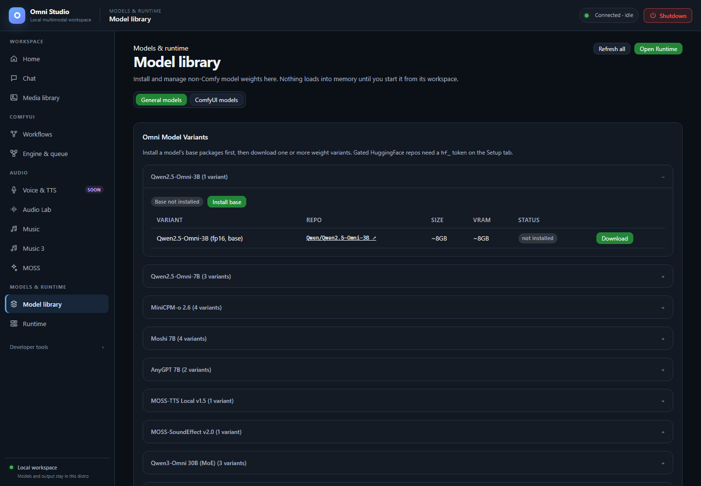

# Model library

*Expand a model family to inspect variants, size and installation status before downloading. Captured September 25, 2026.*

Model library is where weights land on disk. **Nothing in this tab loads a
model into VRAM.** After a download shows `installed` / `ready to load`, you
still spawn or load from Runtime, Chat, Engine, or the matching audio tab.

Open **Models & runtime → Model library**. Two views share the page:

- **General models** — Omni chat families, Audio Lab registry, ACE-Step
  registry, generic LoRAs
- **ComfyUI models** — template catalog, filesystem scan of Comfy folders,
  download jobs for Comfy assets

The switch is sticky. Use ComfyUI models when you are feeding Workflows; use
General models for Chat and audio engines.

**Refresh all** re-reads Comfy, Audio Lab, ACE-Step, setup status, and install
jobs.

## General models

### Omni model variants

Each family is a `
` block (the first one starts open).

**Do this to install a chat model:**

1. If the badge is **Base not installed**, click **Install base**. That pulls
   packages/runtime, not necessarily every weight variant.
2. In the table, pick a **variant** (quantized vs full, size, VRAM estimate).
3. Click **Download** on that row.
4. Watch the job. Gated HuggingFace repos need the Home token first.
5. When the row says **installed** / **ready to load**, go to Runtime or Chat.

The table columns are Variant, Repo (link to huggingface.co), Size, VRAM,
Status. The repo link is the model card you must accept for gated weights.

You do not need every variant. Install one that fits. Qwen 7B GPTQ-int4 is
the verified 24 GB text/image path. Qwen 7B base fp16 is installed-capable
but heavier. 30B families will analyze as invalid on a typical 24+12 GB box;
the installer may still let you download them, which wastes disk. Read
[Feature compatibility](21-feature-compatibility.md) before a 30B download.

Audio Lab and ACE-Step are **not** installed with this Omni "Install base"
button. Their cards live further down (and on their own tabs) because a
generic `/api/setup/install/{model}` correctly refuses them.

### Audio Lab assets

Groups: Stable Audio models, CLAP models, VAE swaps (non-default). Each row
can install or show installed. **Open Audio Lab** jumps to that workspace
after weights exist.

Tiers you will see in the Audio Lab tab itself: official Stability, vetted
community, untested community. Untested community uploads may fail to load.
All downloads go through HuggingFace Xet.

### ACE Step assets

Groups: DiT models, text encoders (LM), VAE swaps. Native 1.5 models also
need a shared core; new installs include it. Partial older installs may
prompt you on the Music tab to install the shared core once.

Lyric2Vocal and Text2Samples adapters are **not** offered as working
downloads. Official weights are unreleased; the registry refuses fake
installs. See [Music](12-music.md).

### Installed LoRAs

This table is the generic Omni-chat LoRA list from Home. It is not ACE LoRA
packs. If it is empty, search on Home. Pick a LoRA later on the Runtime spawn
form for a LoRA-ready family.

## ComfyUI models view

Switch to **ComfyUI models**. The heading changes and the primary jump
buttons become **Workflows** and **Open ComfyUI**.

### Template catalog

The native ComfyUI git checkout contains templates that reference model
files. That catalog is large, so the page does **not** load it until you
click **Load template catalog**.

After it loads:

- Badges show template count, model refs, missing, and "need a link"
- **Search template models** filters by filename, category, template, URL
- Status chips: missing, downloadable, installed, needs-link, all
- Per-row install when a HuggingFace/Xet URL is known
- **Batch downloads (advanced)** — category + limit. Use this only when you
  intentionally want many files. It is easy to fill the VHDX.

"Need a link" means the template named a file but Omni could not find a
download URL. Use **paste a direct HuggingFace/Xet file link** (direct
install into a category) rather than guessing a folder from the display
name.

**Refresh scan** re-reads the checkout. It does not update Comfy core; core
update is a different button on Engine & queue.

### Download jobs

Comfy installs appear here with the same job table pattern as Home. Cancel
running jobs if you picked the wrong file. Deletion of an installed Comfy
asset is immediate and `recoverable: false` — resolve the exact category and
relative filename first (CLI `omni-cli comfy assets delete CATEGORY FILE`).

### Filesystem scan

Below the catalog, Omni lists what is already on disk under
`/opt/omni_studio/comfyui/models/<category>`: checkpoints, diffusion_models,
vae, clip, loras, controlnet, and the rest of the Comfy folder contract.

Empty categories are omitted. This is the truth Workflows will see when it
says a model is missing.

Keep Comfy weights in those category folders. Do not dump `.safetensors` into
the Windows app directory.

## Install jobs versus loaded workers

A completed download is **installation state**. Runtime/Chat/Music **load**
is a different state. You can have ten checkpoints installed and zero VRAM
used. You can also have a worker running after you deleted nothing — delete
the worker first if you need the GPU, not the files.

## HuggingFace failures

Typical toast/log lines:

- 401/403 — token missing, wrong account, or model card not accepted
- disk errors — VHDX/host full; free space on the Windows drive
- Xet/network resets — retry the same job once; do not start a duplicate
  install of the same variant

Save the token on Home, accept the card, then Download again.

## Related pages

- [Home](03-home.md) — token and default downloads
- [Runtime](07-runtime.md) — spawn after install
- [Engine & queue](09-engine-and-queue.md) — Comfy assets and nodes
- [Feature compatibility](21-feature-compatibility.md) — do not download Moshi expecting Chat
