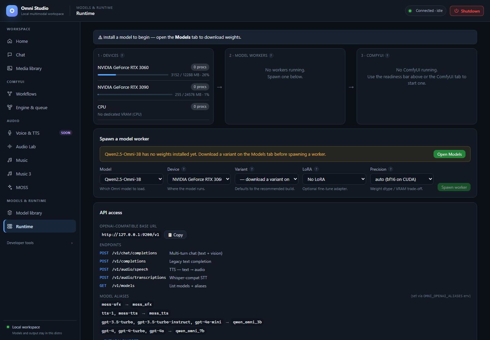

# Runtime

*Device memory, idle worker state and the Windows-facing API address. Memory use includes activity outside Omni. Captured September 25, 2026.*

Runtime is the control room for **devices**, **standalone model workers**, and
a compact view of **ComfyUI instances**. It is also where you create
OpenAI-compatible API keys. Audio engines (ACE-Step, Audio Lab, Music 3, MOSS)
can appear as workers here, but their load/generate UI stays on their own
tabs.

Open **Models & runtime → Runtime**. The page title is Runtime.

## Readiness bar

The top line summarizes Chat and Image/Video:

- **Chat: ready** if at least one non-audio Omni worker is `ready`
- **Chat: no worker** otherwise, with **Start &lt;model&gt;** when a family is
  installed
- **Image/Video: ready** if a Comfy instance is ready
- **Image/Video: start ComfyUI** with a one-click start (auto device, normal
  VRAM)

If nothing is installed, the bar tells you to open Models. It will not spawn
air.

One-click Start uses sensible defaults. For GPU pools, precision, or LoRAs,
use the forms on this page and on Engine & queue instead.

## Stage 1 — Devices

Each GPU (and CPU) is a row:

- marketing name (hover for raw id such as `cuda:0`)
- process count (workers + Comfy instances on that device)
- a VRAM bar: used / total MB

This list is the live `GET /api/devices` picture: current `cuda:N` indices,
free VRAM, and compute PIDs. Indices can change between boots. Saved
placement policies use **stable NVIDIA GPU UUIDs**, not remembered `cuda:1`.
See [GPU placement](19-gpu-placement.md).

If a card is full of "foreign" compute PIDs (another Windows app, another
WSL process), placement will warn. Close those apps or pick the other GPU.

Refresh happens on a poll; you can also use system refresh from the CLI.

## Stage 2 — Model workers

Workers are grouped by family. Each line shows status, variant, precision,
optional LoRA, and VRAM. Hover for worker id and port.

Actions:

- **Logs** — last lines from that worker
- **Kill** — stop that exact worker and release its model
- **Kill all workers** — every managed worker. Confirm. Running inference is
  lost. Do not use this to unload one ACE-Step model; kill the one id.

Statuses move through starting → ready → busy → dead. A worker that times
out during ACE/Audio Lab inference is **retired**, not returned to ready with
poisoned CUDA state. Spawn again if you still need it.

MOSS, Audio Lab, and ACE-Step workers may show up here after their tabs load
them. Killing them here is valid cleanup. Generating still happens on the
audio tabs.

### Spawn a model worker

The form under the pipeline:

1. **Model** — family, including audio families. Friendly names, raw ids as
   values.
2. **Device** — current GPU/CPU from the device list. Pick free VRAM.
3. **Variant** — only **installed** variants. If the list says to download on
   Models, do that first.
4. **LoRA** — only for LoRA-compatible families, and only adapters that have
   an adapter file. Choose **No LoRA** when unsure.
5. **Precision** — `auto (bf16 on CUDA)`, fp16, bf16, fp32. **Moshi** disables
   this dropdown because dtype is baked into the variant name.
6. **Spawn worker**

If the family has no weights, a banner points to Model library and Spawn is
disabled. ACE-Step extra banners appear when the shared v1.5 core or an LM is
missing; those installs happen on the Music tab. Spawning ACE from Runtime
only starts the process; generation still loads components from Music.

**Do this for a Chat model:**

1. Install base + one variant.
2. Pick the 24 GB GPU for 7B-class models.
3. Leave LoRA empty.
4. Precision auto.
5. Spawn, wait for ready (toasts say this can take a minute).
6. Open Chat and send.

If spawn fails with a placement error, stop. Run analyze-before-run as in
[GPU placement](19-gpu-placement.md). **`valid: false` is a hard stop.** Do
not retry the same oversized 30B variant on the same cards.

GPTQ Qwen variants must stay on **single** GPU placement; auto sharding is
blocked for that loader. Runtime's simple spawn is single-device, which is
the safe default.

## Stage 3 — ComfyUI

Each instance shows status, device, VRAM mode, used VRAM, and a port. When
status is ready, **Open :PORT** launches the native ComfyUI front-end in a
new window (still on this machine). **Logs** and **Stop** affect that
instance. **Stop all ComfyUI** asks for confirmation.

Starting Comfy from here uses auto device + normal VRAM. For GPU pool,
preview method, and low-VRAM flags, use [Engine & queue](09-engine-and-queue.md).
Starting the engine does **not** load a checkpoint.

## API access

The **API access** card is how external tools on Windows talk to the same
gateway.

- **OpenAI-compatible base URL** — copy `http://127.0.0.1:9200/v1` (the
  displayed host follows the live session; 9200 is the Windows bridge).
- Endpoints listed: `/v1/chat/completions`, `/v1/completions`,
  `/v1/audio/speech`, `/v1/audio/transcriptions`, `/v1/models`.
- **Model aliases** map names like `gpt-4o` onto native ids when configured.
- A Python snippet is under a disclosure.

**Auth:** default **loopback-token** mode accepts the per-instance session
token. A newly created API key does not authenticate in that mode. Start the
gateway with `OMNI_AUTH_MODE=bearer` to accept registered bearer keys; the
local session token continues to work for the UI.

### Create an API key

1. Click **+ New key**.
2. Enter a label (`my-python-app`).
3. Enter scopes: `admin`, `read`, `generate`, `manage` (comma-separated).
4. Copy the secret from the modal **now**. It is not shown again.
5. In bearer mode, use `Authorization: Bearer <key>` against `/v1`.

**Revoke** immediately invalidates that key. The list never prints secrets,
only ids, labels, scopes, and last-used time.

Never paste the Omni loopback token or a bearer key into a screenshot, a
git repo, or this manual's examples. The UI already warns you.

`/v1/audio/speech` is not a substitute for the Soon Voice & TTS page. Only
registered local TTS models answer it; Qwen native talker is not registered,
and MiniCPM TTS is blocked.

## Unload discipline

When you are done with Chat:

1. Kill the exact worker (not Kill all, unless you mean it).
2. Confirm Devices VRAM dropped.
3. Only then load ACE-Step, Music 3, or a large Comfy graph.

Crossing families without an unload is the usual OOM.

Full app teardown is [Shutdown](17-shutdown.md), not Kill all.

## Related pages

- [Chat](04-chat.md)
- [Engine & queue](09-engine-and-queue.md)
- [GPU placement](19-gpu-placement.md)
- [Command-line interface](18-cli.md) — `omni-cli workers spawn|kill|list`
