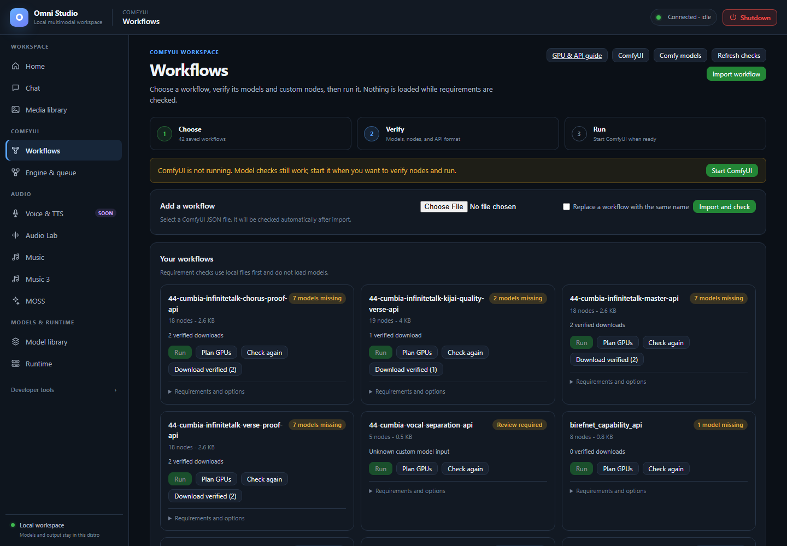
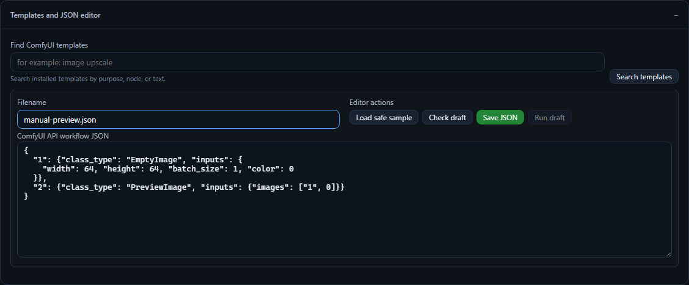

# Workflows

*Saved workflow requirements after checking. Missing models and stopped Comfy keep Run disabled. Captured September 25, 2026.*

Workflows is the ComfyUI graph operator: **choose** a JSON graph, **verify**
its models and custom nodes, then **run** it. Requirement checks do not load
weights. Running does.

Open **ComfyUI → Workflows**. Keep [Engine & queue](09-engine-and-queue.md)
nearby; Run needs a ready Comfy instance, but you can import and check files
while the engine is stopped.

The in-app **GPU & API guide** (`/static/comfy-api-guide.html`) is the same
contract as `docs/comfy-api.md`. This page is the GUI how-to.

## Three-step strip

1. **Choose** — import or pick a saved graph
2. **Verify** — models, nodes, API format, GPU plan
3. **Run** — queue on a ready instance

If ComfyUI is not running, a warning banner offers **Start ComfyUI**. Model
checks still work. Node checks and Run wait for an instance.

## Import a workflow

**Do this:**

1. Click **Import workflow** (or use the file field in **Add a workflow**).
2. Select a `.json` file exported from ComfyUI.
3. Check **Replace a workflow with the same name** only when you intend to
   overwrite.
4. Click **Import and check**.

**Then:** the graph appears under **Your workflows** and Omni inspects
requirements without loading models.

### API format versus UI format

Comfy's editor JSON is not directly queueable. Export **API format** from
ComfyUI (File → Export (API) in upstream UI). If analysis reports
**API export needed**, open the graph in the native Comfy window from Engine
& queue, export API format, and import that file.

Do not paste a screenshot. Do not import a `.png` workflow image here; Media
library can show embedded metadata, but this importer wants JSON.

## Your workflows

Each card shows the name, node count, size, and a readiness badge:

| Badge | Meaning | What you do |
|---|---|---|
| Ready | Models and nodes verified | Plan GPUs, then Run |
| N models missing | Files not on disk | **Download verified** when sources are known, or find a source |
| N nodes missing | Custom node not in the live instance | Install the node on Engine & queue, restart if required, Check again |
| API export needed | UI-format graph | Re-export API JSON |
| Review required | Unknown custom model input | **Search all folders** / find source |
| Checking | Scan in flight | Wait |
| Models checked | Files OK, Comfy not up for node verify | Start Comfy, Check again |

**Run** is disabled until `ready_to_run` is true on a live instance. The
tooltip says to resolve readiness first. That is the GUI form of
analyze-before-run.

Other card actions:

- **Plan GPUs** — runs analysis with the current placement policy, still
  without loading weights
- **Check again** — refresh requirements
- **Download verified (N)** — install missing models that have a known
  source
- **Open JSON** / **Delete** — under **Requirements and options**

Delete is immediate. There is no recycle bin.

### Run on

When at least one Comfy instance is ready, **Run on** picks the instance.
That instance also enables live custom-node verification. Auxiliary GPUs are
only usable if they are in that instance's **gpu_pool**. If a plan says
`restart-required`, stop and start Comfy with the missing GPU checked. You
cannot hot-add a GPU to a running instance.

## GPU placement on this page

Open **GPU placement**. This is the same `single` / `auto` / `manual` policy
object the API stores as workflow metadata (not inside portable graph JSON).

- **Mode**
  - **Single GPU** — every component on the preferred GPU
  - **Automatic pool** — place components across eligible cards when useful
  - **Manual / hybrid** — lock selected components; the rest are still
    planned automatically
- **Preferred GPU** — single mode uses only this card; pool modes prefer it
  for the main diffusion model. Options use **stable GPU UUIDs**.
- **VRAM reserve (MB)** — headroom kept free on every eligible GPU (default
  1024).
- Checkboxes — which UUIDs are eligible. Unchecked cards are invisible to
  the planner even if they exist in the host.
- **Advanced: require every selected GPU to receive a component** —
  `require_all`. Leave off unless you truly need a component on every card.
  "Use all GPUs" normally means they are eligible, not that the planner
  must invent dummy assignments.

The hint on the panel is the product rule: **Plan checks do not load
models. GPU UUIDs are saved in policies so selections survive CUDA index
changes.**

After **Plan GPUs**, the card shows a **GPU plan** with status, component
rows, blockers, and warnings. Ordinary routing is **component placement**
(MODEL / CLIP / VAE), not layer sharding of one UNet.

### Analyze-before-run and `valid: false`

Omni always re-analyzes at queue time. You should still press **Plan GPUs**
(or **Check draft**) and read the plan.

If the plan's `valid` field is false, or the badge is blocked:

- **That is a hard stop.** Do not Run.
- Read `blockers` (missing VRAM, missing pool GPU, host RAM, cgroup budget).
- Shrink the graph, pick a lighter checkpoint, enable a real low/none VRAM
  instance, or unload other workers.
- Never "just queue it anyway."

`valid: false` and `ready_to_run: false` are the same operator meaning: the
app is protecting the GPU. Bypass is not offered in the GUI because bypass
is how you OOM the WSL VM.

Warnings are not blockers. Foreign compute PIDs, overlap of ordinary
loaders, and staged-vs-ordinary notices are warnings. Blockers are
blockers.

A Comfy `prompt_id` on a successful Run means the engine **accepted** the
prompt. It does not mean the PNG exists. Watch Engine & queue, then confirm
the file in Media library.

## Templates and JSON editor

Open **Templates and JSON editor**.

- Search installed Comfy templates by purpose, node, or text, then
  **Search templates**.
- **Filename** + textarea: paste API JSON.
- **Load safe sample** — a tiny known-good graph for wiring tests.
- **Check draft** — analyze-before-run on the textarea.
- **Save JSON** — persist to the workflow store.
- **Run draft** — disabled without a ready instance; still respects a
  blocked plan.

This editor is for API JSON, not Python.

## Missing models and nodes

Inside **Requirements and options**:

- Missing models with **verified source** can be downloaded from the card.
- **Find source** / **Search all folders** for unclassified inputs. Do not
  invent a Comfy folder from a display name. Category + relative filename
  must be exact.
- Missing node types need a custom node install on Engine & queue, then a
  restart of that instance if the node only loads at process start.

Core Comfy update and Manager `update_all` are different operations. Do not
assume one did the other.

## Staged graphs

Staged H3/LTX nodes release their owned models between phases. Generic
staged VAE decode releases its own VAE only, leaving ordinary upstream
loaders resident.
The plan's `summary.staged` flag tells you whether every heavy component
actually has that contract. Ordinary `OmniRoute*` placement can keep weights
resident. If the combined graph cannot fit, use staged nodes or a smaller
stack — do not hope auto placement will layer-shard a diffusion model.

## Related pages

- [Engine & queue](09-engine-and-queue.md)
- [GPU placement](19-gpu-placement.md)
- [Media library](05-media-library.md) — where PNGs land
- [Model library](06-model-library.md) — ComfyUI models view

## JSON editor example

The example above uses EmptyImage and PreviewImage to explain the API graph
format. It is an unsaved draft; this screenshot does not show a queued or
completed workflow. **Check draft** validates readiness before **Run draft**.
