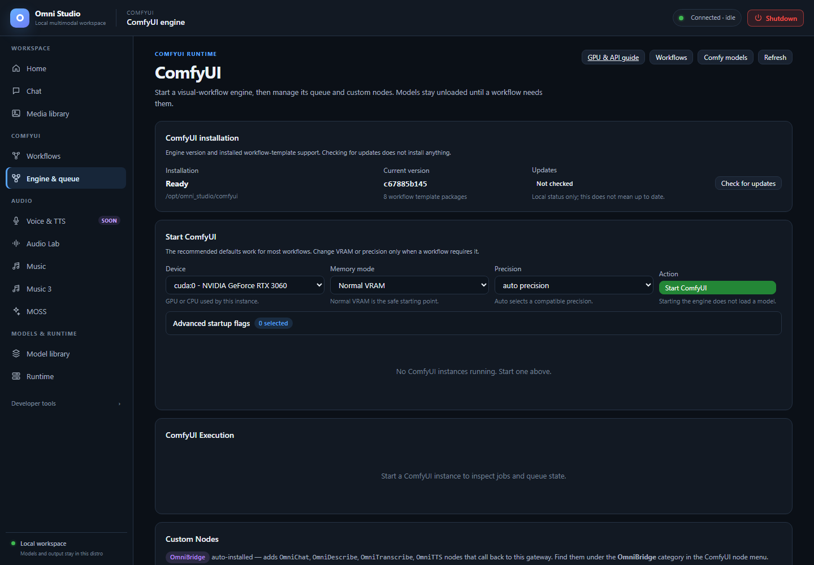

# Engine & queue



*Local Comfy installation is ready, but no instance is running. No remote update check was performed. Captured September 25, 2026.*

**Engine & queue** is the ComfyUI runtime page: install status, start
options, GPU pool, live queue, and custom nodes. Models stay unloaded until
a workflow needs them. Starting the engine is not "loading SDXL."

Open **ComfyUI → Engine & queue**. The HTML id is `comfy`; the visible title
is ComfyUI / Engine & queue depending on the nav label. The sidebar says
**Engine & queue**.

Jump buttons: **GPU & API guide**, **Workflows**, **Comfy models**,
**Refresh**.

## Installation card

This block reports whether ComfyUI is on disk, the current git commit, how
many workflow-template packages are present, and whether an update check has
run.

- **Check for updates** queries the remote. It does **not** install.
- **Update available** shows the target commit. Core update is a separate,
  explicit operation from Manager `update_all`.
- **Not checked** means you only have local status. That is not the same as
  "up to date."

Do not update core in the middle of a long video graph. Stop the instance,
update, confirm the commit, then start again.

## Start ComfyUI

**Do this for a first instance:**

1. **Device** — pick the primary GPU (`cuda:N - marketing name`). This card
   becomes logical `cuda:0` inside the Comfy process.
2. Leave **Memory mode** on **Normal VRAM** unless a documented graph
   requires low/none.
3. Leave **Precision** on **auto precision**.
4. If you have two or more NVIDIA GPUs, leave **Enable component placement**
   checked. The primary stays checked and disabled. Check every auxiliary
   GPU the workflow may use. Unchecked cards are **invisible** to placement
   for this instance's lifetime.
5. Click **Start ComfyUI**.

**Then:** the instance appears in **Running instances** with status
`starting`, then `ready`. A first GPU start can take a few minutes while
WSL initializes the shared CUDA driver. The yellow note is explicit: no
model weights are being loaded during that wait.

**Stop all** / per-instance **Stop** tear the process down. **Logs** show
that instance's output.

Opening the port link (when ready) opens native ComfyUI. Use it to edit
graphs visually, then export API JSON back into Workflows. OmniBridge custom
nodes appear in the Comfy node menu under **OmniBridge**.

### GPU pool

The pool is primary-first. Placement cannot see a GPU you omitted. If
Workflows later reports `restart-required`, you must stop this instance and
start another with the extra UUID/device checked. There is no "add GPU"
button on a live process.

Never assume the second card is visible because Runtime listed it. Check
this instance's pool.

### Memory modes

| Mode | When to use |
|---|---|
| Normal VRAM | Default. Planner will not assume CPU offload will rescue an oversized assignment. |
| Force Normal VRAM | When Comfy would otherwise pick a more aggressive mode |
| High VRAM | Keep models loaded; needs headroom |
| GPU Only | Avoid CPU fallback |
| Low VRAM | Offload-heavy graphs; planner may accept a small GPU deficit if the cgroup CPU budget fits |
| No VRAM (CPU offload) | Last resort for huge graphs; slow |
| CPU Only | No CUDA; debugging |

HuMo-class 17B graphs have been shown to OOM a 24 GB primary on low VRAM
alone; those need documented `none` or low + large `reserve_vram` flags.
Set those under advanced startup flags, then analyze-before-run. If the
plan is `valid: false`, do not queue.

### Advanced startup flags

Open the disclosure. **Quick picks:**

- **Preview method** — Automatic, None, Latent2RGB, TAESD
- Featured flags from the live catalog (attention, cache policy, dynamic
  VRAM) when the gateway advertises them
- Category groups from `GET /api/comfy/start-options` — only open what you
  need
- **Troubleshooting → Disable pinned memory** — useful on low-RAM or
  incompatible hosts (`--disable-pinned-memory`)

A badge counts how many flags differ from defaults. Do not invent raw CLI
flags when a structured option exists.

`reserve_vram` is a Comfy-wide flag. It reduces usable memory on auxiliary
GPUs too. Omni's per-device placement reserve is a different number, set on
Workflows.

## Execution (the queue)

Once an instance is ready, **ComfyUI Execution** shows:

- instance picker
- **Refresh**
- **Clear Pending** — drop queued-but-not-started prompts
- **Cancel All** — interrupt running work
- **Unload Models** — Comfy `/free` with unload; VRAM should drop if nothing
  is mid-graph

The panel lists running vs pending counts and recent jobs. A successful
Workflows **Run** shows up here as a job with a `prompt_id`. Watch until
finished, then open Media library. HTTP 200 on queue is not a PNG.

Interrupt/cancel does not always stop a CUDA kernel instantly. If a job
is stuck after cancel, Stop the instance.

CLI equivalents: `omni-cli comfy watch INSTANCE`, `comfy interrupt`,
`comfy free --unload-models`.

## Custom nodes

The **Custom Nodes** card lists installed/disabled nodes. OmniBridge is
auto-installed and exposes `OmniChat`, `OmniDescribe`, `OmniTranscribe`,
`OmniTTS` that call back into this gateway. They still require a ready Omni
worker for the matching modality, and they inherit the same feature compatibility rules
(Qwen will not transcribe via a 501 path).

Install additional nodes from:

- this card's Manager/catalog actions when shown
- CLI `omni-cli comfy nodes install <repo_url>`
- Engine extensions APIs (`/api/comfy/extensions/manage`)

Enable/disable/update/remove are distinct. Core update ≠ Manager update_all.
After a node install that loads only at process start, Stop and Start the
instance, then Check again on Workflows.

Delete of an asset-managed node is immediate.

## Assets (models on disk)

Engine & queue does not replace the ComfyUI models view. Use Model library's
ComfyUI mode for template installs and the category filesystem scan. CLI:

```bat
omni-cli.bat comfy assets list checkpoints
omni-cli.bat comfy assets install checkpoints org/repo --file model.safetensors
omni-cli.bat comfy assets delete checkpoints exact-filename.safetensors
```

Deletion reports `recoverable: false`. Resolve category + relative filename
from the scan; do not infer `loras/` from a display name that says "LoRA."

Uploads go through the authenticated instance (`upload/image`, `upload/mask`)
or `comfy assets upload`. Do not copy files into a guessed
`C:\...ComfyUI\input` path on Windows.

## Multiple instances

You can start more than one Comfy if you have the GPUs and RAM. Each has its
own port, pool, and queue. Workflows' **Run on** must point at the instance
whose pool contains the GPUs in the placement policy.

Stop unused instances. Two Comfy processes plus ACE-Step plus a 7B chat
worker is how WSL runs out of host RAM even when VRAM looks fine.

## Related pages

- [Workflows](08-workflows.md)
- [GPU placement](19-gpu-placement.md)
- [Runtime](07-runtime.md) — compact instance list
- [Command-line interface](18-cli.md)
