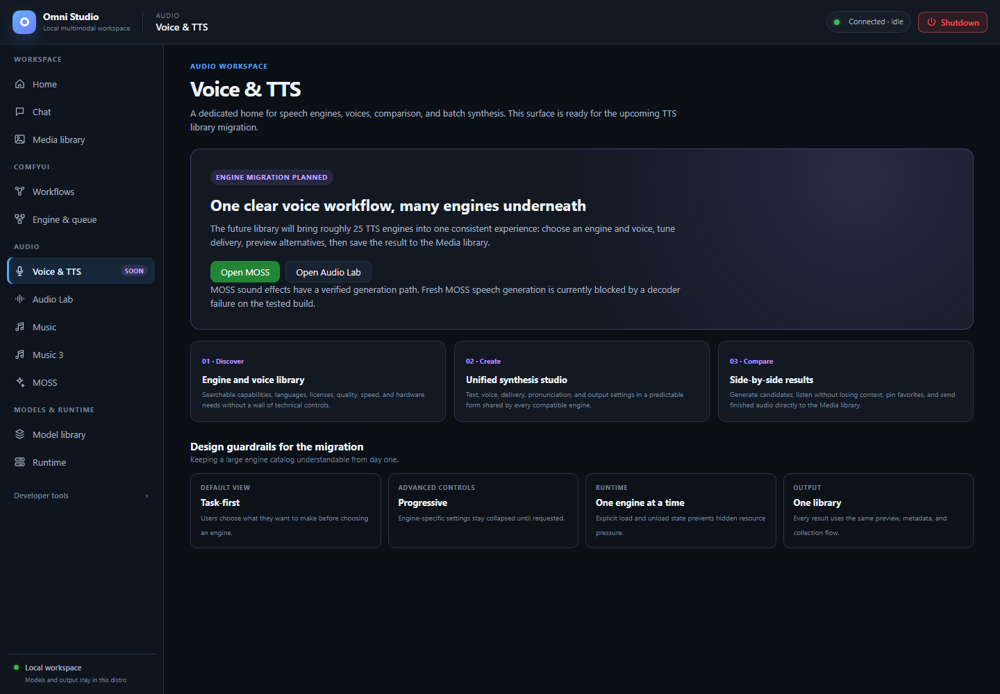

# Voice & TTS

*The speech workspace is marked Soon. Its roadmap is not evidence of working speech generation. Captured September 25, 2026.*

**Voice & TTS** is a reserved destination in the Audio group. The sidebar
badge says **Soon**. Home's Voice & TTS card carries the same badge. This
page exists so you know what you are looking at and which speech paths are
currently usable.

Open **Audio → Voice & TTS**. The page title is Voice & TTS.

## What you will see

The screen is a roadmap, not a synthesizer:

- Status: **Engine migration planned**
- Copy describing a future library of many TTS engines, one consistent
  form, side-by-side comparison, and Media library output
- Three cards: Discover, Create, Compare
- Design guardrails: task-first default view, progressive advanced
  controls, one engine at a time, one output library

There is **no** engine picker, **no** voice list, **no** Generate button,
and **no** working batch synthesis on this tab.

Treat that as product honesty, not a broken install. You cannot "enable" Voice
& TTS by downloading a Chat model or by spawning Moshi.

## What to use today

The page itself offers two buttons:

- **Open MOSS** — opens [MOSS](14-moss.md). Its sound-effects engine works,
  but a fresh MOSS-TTS inference failed in the decoder on the tested build.
- **Open Audio Lab** — sound design and music beds, not a TTS voice library.

For a voice-based workflow now:

- Use an already saved MOSS WAV or a recorded vocal as ACE-Step
  **Vocal→BGM** source audio.
- Use MiniCPM-o in Chat for **understanding** speech, not for speaking

There is no currently qualified fresh local TTS generation path in this build.
Do not load MOSS-TTS repeatedly to test whether the decoder error has gone
away; check [Feature compatibility](21-feature-compatibility.md) before attempting it again.

## What not to use as a Voice & TTS substitute

| Surface | Why it is not Voice & TTS |
|---|---|
| Moshi | No usable batch or full-duplex stream path. Chat hides it. Testing disables batch. Loading weights cannot make the current API functional. |
| Qwen native Talker / `/api/tts` for Qwen | Not registered. Requests return 501. Official upstream speech exists; Omni has not wired it. |
| MiniCPM `/api/tts/minicpm_o` | Reaches the decoder then fails (`get_mask_sizes`). Do not advertise or operate this as working TTS. |
| Runtime `/v1/audio/speech` | Only registered local TTS models. Same limits as above. |
| ACE-Step Lyric→Vocal | Specialized adapter; official weights unreleased. Registry refuses false installs. |

When Voice & TTS leaves Soon, this manual page should be rewritten as a
real operator guide. The MOSS link currently opens a page whose speech controls
are visible but not qualified for a new generation.

## Related pages

- [MOSS](14-moss.md)
- [Feature compatibility](21-feature-compatibility.md)
- [Home](03-home.md)
