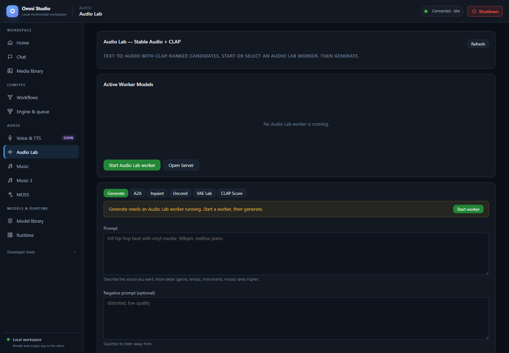

# Audio Lab

*Generate controls with no Audio Lab worker. Load a compatible engine before submitting audio work. Captured September 25, 2026.*

Audio Lab is the **Stable Audio + CLAP** workspace: install weights, load
them onto an explicit GPU, then generate, transform, score, or inspect
latents. It is not ACE-Step (Music) and not MiniMax (Music 3).

Open **Audio → Audio Lab**.

## Mental model

1. **Status** — which SA / VAE / CLAP variants are on disk
2. **State** — whether a worker is running and which components are loaded
   (`autospawn=false` is the cheap read; the tab uses that idea)
3. **Inference** — synchronous. The result has a `job_id` that names the
   output folder. Do **not** poll the generic jobs table for generate.
4. **Unload** — free `sa`, `clap`, `vae`, or `all`, then delete the worker
   if you need the GPU for Comfy or Music

Cross-tool note: ACE-Step **generate-ranked** can use a loaded Audio Lab
CLAP worker. If CLAP is not loaded, ACE ranking falls back to unranked
output and the Music tab shows a notice.

## Install weights

Scroll to the registry cards:

- **Stable Audio Models** — pick a base. Tier 1 official Stability, Tier 2
  vetted community, Tier 3 untested community (may fail to load).
- **VAE Swaps** — optional autoencoder replacement at load time. Default
  keeps the model's own VAE.
- **CLAP Scoring Models** — used to rank candidates against text.
  `larger-clap-general` is the default.
- **Custom HuggingFace Repo** — `org/name`, optional local name, kind
  model/vae/clap. The loader auto-detects diffusers vs native format.

Verified starting recipes:

- **Stable Audio Open Small** — short effects, duration at or below **11 s**,
  about 8–10 steps
- **Stable Audio Open 1.0** — generation/effects up to **47 s**, plus A2A
  and inpaint
- Community models in the confidence matrix (SAO Instrumental, Audialab EDM,
  Nekochu Music, Infinite Pianos, Vocal Textures) have been cold-loaded for
  short WAVs; their declared native ceiling is 120 s, but listen before you
  trust a long take

Official Stability repos are often gated. Save a HuggingFace token on Home
and accept the model card first.

Installs return a background job. Poll that job. Deletion of a variant is
immediate — unload first.

You can also install from Model library's General view or
`omni-cli audio-lab install-model sao-open-small`.

## Load the engine

The **Active Worker Models** card shows running / not running and which
components are loaded.

**Do this:**

1. Refresh if the card still says Loading.
2. Open load controls if they are collapsed.
3. Choose an explicit CUDA device with enough free VRAM (do not rely on
   "whatever is default" when a 12 GB card is already full of Comfy).
4. Select an SA variant, optional VAE swap, optional CLAP.
5. Load. Wait until the badge shows the components.

If several Audio Lab workers exist, pick the worker id. Pass at least one
component on each load call.

**Unload** / **Cancel** sit on the same card. Cancel is best-effort: the
current diffusion step may finish, then further candidates abort. After a
server-side timeout the exact worker is retired rather than left `ready`.

## Modes

Mode tabs: **Generate**, **A2A**, **Inpaint**, **Uncond**, **VAE Lab**,
**CLAP Score**. The active form is the only thing Generate submits.

### Generate

Text-to-audio/music/effects.

1. Write a concrete prompt ("single dry snare hit in a small booth, no
   reverb tail" not "nice sound").
2. Optional negative prompt ("melody, speech, distortion").
3. Set duration within the checkpoint's ceiling (11 s Small, 47 s Open 1.0
   unless a community model documents more).
4. Steps, CFG, sampler (query the sampler list; do not assume one family),
   optional seed.
5. Submit. Wait. The call is synchronous and can be long.

**Ranked generation:** request N candidates (the API allows a small fanout;
the implementation generates sequentially). Load CLAP first. Optional
score prompt defaults to the generate prompt. The best file is marked in
the results.

### A2A

Audio-to-audio. Stage an init WAV (upload or **Use as init** from job
history) and set `init_noise_level` from 0 (near copy) to 1 (near new).
Audio Lab source URLs currently accept Audio Lab output URLs; otherwise
send the file from the form (base64 under the hood).

### Inpaint

Provide source audio plus `mask_start_s` and `mask_end_s`. Current
diffusers inpaint **regenerates and splices**; it is not native latent
masking. Listen to the seam.

### Uncond

Duration and sampler without a text prompt. Useful for latent/VAE
experiments, not for "make a song."

### VAE Lab

Encode, decode, or reconstruct. Reconstruction is lossy and can shorten
the waveform slightly. Use RMS diagnostics in the result, then listen.

### CLAP Score

Score existing audio against a text prompt with the loaded CLAP. This does
not generate audio.

## Results and job history

The **Results** card plays the latest run. Job history lists past inference
runs with mode, truncated id, optional best CLAP score, prompt snippet,
**Use as init**, **ZIP**, **Open**, and delete.

ZIP and Open are how you pull files. They also appear in Media library
under **Omni (TTS / STT)**.

Deleting a job deletes its files. Confirm.

## Operator recipe (short effect)

1. Home: HuggingFace token if the repo is gated.
2. Install `sao-open-small` and `larger-clap-general`.
3. Unload Chat/Comfy if the only GPU is 12 GB.
4. Load SA + CLAP on that GPU.
5. Generate 8 s, 10 steps, CFG 7, a concrete acoustic prompt.
6. Play in Results; confirm in Media library.
7. Unload all; kill the worker on Runtime if the process remains.

## Related pages

- [Music](12-music.md) — songs; can consume CLAP from this tab
- [MOSS](14-moss.md) — a second SFX path (different model, 30 s ceiling)
- [Feature compatibility](21-feature-compatibility.md)
- [Command-line interface](18-cli.md) — `omni-cli audio-lab generate`
