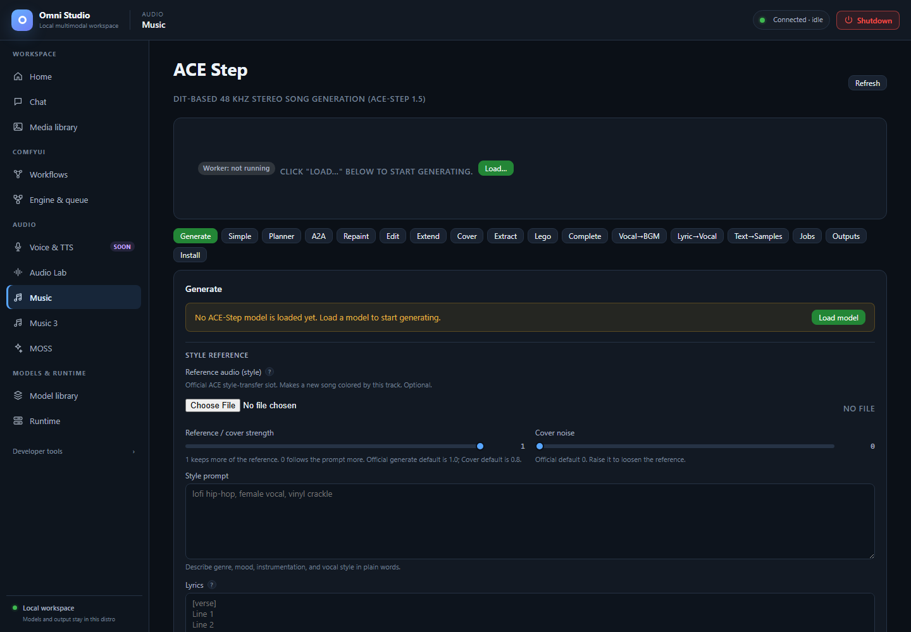

# Music (ACE-Step)

*ACE-Step task controls in their unloaded state. Visible transformations have separate model requirements. Captured September 25, 2026.*

**Music** is ACE-Step 1.5: DiT-based 48 kHz stereo song generation. The
sidebar label is **Music**; the page heading says ACE Step. It is not MiniMax
Music 3 and not Audio Lab.

Open **Audio → Music**.

Sub-tabs across the top: Generate, Simple, Planner, A2A, Repaint, Edit,
Extend, Cover, Extract, Lego, Complete, Vocal→BGM, Lyric→Vocal,
Text→Samples, Jobs, Outputs, Install.

Lyric→Vocal and Text→Samples are **blocked** unless upstream assets exist.
They are documented last so you do not plan a session around them.

## Live status card

The top card is the worker:

- **Worker: not running** — click **Load…**
- **Worker: ready** plus badges for model, LM, optional VAE swap, attached
  LoRAs
- **CLAP via audio_lab** green if Audio Lab has CLAP loaded (ranked generate
  will score); orange if unavailable (ranked still generates, unranked)
- **Change…** / **Unload all**

If **runtime dependencies are missing**, repair the app venv/setup before
any load. If a native model is installed but the **shared v1.5 core** is
missing, use **Install shared core**. New native installs include the core;
old partial installs may not.

Generation forms stay disabled until a **base model is loaded**. Loading
the worker process from Runtime is not enough.

## Install (sub-tab)

Install DiT models, LMs, VAE swaps, LoRA packs, and custom HF repos here
(or from Model library / `omni-cli ace-step install-*`).

Practical stacks:

| Goal | Model | LM | Notes |
|---|---|---|---|
| Fast general songs | `ace-1.5` / 2B turbo | `ace-lm-0.6b` | Verified through 120 s; turbo defaults ~8 steps, CFG 1.0, shift 3.0 |
| Higher quality on two GPUs | `ace-xl-sft` | `ace-lm-4b` on the other GPU | 4B LM needs the second card cleared |
| XL turbo | `ace-xl-turbo` + 1.7B LM | ~19 GB VRAM in tests; cold page-in can take many minutes | |
| Base-only extract/lego/complete | `ace-base` / `ace-xl-base` | defaults ~50 steps, CFG 4.0 | |

LoRA packs with verified attach/detach: raspy, acoustic, Chinese New Year,
lofi, raga. Start multiplier **0.4–0.5** (safe band about 0.2–0.7). The
legacy Chinese Rap package is installed-incompatible (not PEFT) and blocked.

Installs are background jobs. Poll them. Delete is immediate; unload first.

## Load…

The load modal/form asks for:

- **model variant** (required for generation)
- **LM variant** (required for lyric/caption paths that need the 5 Hz LM)
- **VAE** default or swap
- **device** and optional **lm_device** (ACE can put DiT on the primary GPU
  and the LM on an auxiliary GPU — component split, not HF layer sharding)
- **bf16** (default), optional CPU offload, optional int8 on XL, optional
  torch.compile (slow first run)

Only send components you want to change. A model hot-swap frees the previous
weights first. Do not enable CPU offload on a GPU that already fits.

After load, confirm the live card. Then generate with `autospawn` conceptually
false: the model is already resident.

## Generate

Main song form.

**Do this:**

1. **Prompt** — style, genre, vocal character, mix notes.
2. **Lyrics** — optional. Use `[Verse]`, `[Chorus]`, `[Bridge]` tags. Omit
   lyrics and say `instrumental, no vocals` for beds.
3. **Negative prompt** — on v1.5 this is the LM negative prompt.
4. **Duration** — 1 to 600 seconds documented. Long tracks should still be
   composed from sections; listen for continuity.
5. **Steps / CFG / scheduler** (`euler`, `heun`, `dpmpp`) / **shift**
   (1.0–5.0; turbo 3.0, SFT/base 1.0).
6. Optional **BPM** (30–300), **keyscale** (`D minor`), **time signature**
   (`4` for 4/4), **seed**, guidance interval.
7. **Generate** or ranked N=1–16.

The call is **synchronous**. The returned `job_id` is an output folder, not
a background job to poll. Play the WAV from the result, Jobs, Outputs, or
Media library (Omni source).

`infer_method`: `ode` is the official default (use for SFT). `sde` is known
to garble SFT. Leave Adaptive Dual Guidance off unless you know you want it.

### Ranked generate

`n` candidates, optional CLAP score prompt. Without Audio Lab CLAP, results
are unranked. With CLAP, pick the best_ file and still listen; CLAP is not a
mix engineer.

## Simple and Planner

- **Simple** — style query → caption/lyrics/BPM/key then generate in one
  operator action (`create-sample` then generate).
- **Planner** — LM planning helpers (`format-sample`, `understand`). Use
  when you want the 5 Hz LM to rewrite metadata; turn **thinking** off on
  Generate if you want to skip CoT rewrite even with an LM loaded.

Language list on the tab is large (en, zh, ja, …). It labels lyric language
for the LM; it is not a guarantee of native pronunciation quality.

## Transform existing audio

These modes take **init audio** (upload or a library URL such as an ACE
output or a MOSS WAV in the Omni library):

| Mode | What it does | Extra fields |
|---|---|---|
| **A2A** | Restyle / denoise toward the prompt | `init_noise_level` 0–1 |
| **Repaint** | Replace a time range | `mask_start_s`, `mask_end_s` inside duration |
| **Edit** | Lyrics-only or remix | `only_lyrics` or `remix`; optional source prompt/lyrics |
| **Extend** | Prepend or append new audio | `prepend`/`append`, extend duration. On SFT this pads silence and repaints the new region |
| **Cover** | Re-style a song | describe the target in the prompt |
| **Vocal→BGM** | Voice or vocal stem → accompaniment | optional accompaniment prompt. MOSS TTS output URLs are valid sources |

**Completion and extension are generative, not lossless splices.** In current
base-model tests the retained portion changed. If you must keep existing
audio bit-stable, use **composition** on library files instead (see
[Jobs, tokens, composition, and media retrieval](20-jobs-huggingface-and-special-usages.md)).

**Analyze** (API / advanced) returns BPM, key, loudness. It does not prove
the track is musically coherent.

## Base-only arrangement

Load `ace-base` or `ace-xl-base` first:

- **Extract** — `track_name` from the list (woodwinds, brass, fx, synth,
  strings, percussion, keyboard, guitar, bass, drums, backing_vocals, vocals)
- **Lego** — rebuild from tracks
- **Complete** — `track_names`

These are not a DAW. They need the base model, not turbo-only.

## LoRAs at runtime

Load the base model. **Attach** an installed pack with the exact
`adapter_file` when the pack has several files (required to choose among a
declared pack). **Detach** by name. Status shows recommended multiplier
ranges; do not guess filenames inside a repo.

## Jobs and Outputs

- **Jobs** — persisted ACE output jobs, open/delete/zip
- **Outputs** — files for a job id

Delete removes the folder. ZIP is the Windows-friendly retrieval path along
with Media library export.

## Lyric→Vocal and Text→Samples (unavailable)

These sub-tabs exist because the ACE-Step product defines the modes.

- Official **Lyric2Vocal** and **Text2Samples** weights are **unreleased**.
- The registry **refuses false installs**.
- Specialized endpoints are not usable with official weights.
- Do not follow third-party "just download this LoRA" advice unless Omni's
  status page shows the adapter as installed **and** `enables_mode` for that
  tab. Until then the mode is blocked.

Use Generate with lyrics for sung songs, Vocal→BGM for accompaniment from a
voice, and Audio Lab / MOSS-SFX for one-shot samples.

## Unload

`Unload all` on the live card, or unload `model` / `lm` / `vae` separately.
Then kill the exact ACE worker on Runtime if you need the GPU for Comfy.

Do not leave XL + 4B LM resident "for later" while you start Music 3.

## Related pages

- [Audio Lab](11-audio-lab.md) — CLAP ranking and short beds
- [Music 3](13-music-3.md) — different engine, lyrics required
- [MOSS](14-moss.md) — speech source for Vocal→BGM
- [Feature compatibility](21-feature-compatibility.md)
