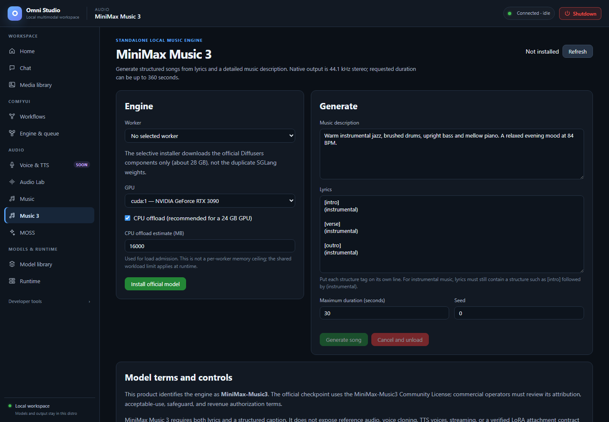

# Music 3 (MiniMax Music 3)



*An unsent instrumental example with a 30-second duration and the RTX 3090 selected. The model is not installed; Generate is disabled. Captured September 25, 2026.*

**Music 3** is a standalone MiniMax-Music3 engine: structured songs from a
**music description plus lyrics**. It is not ACE-Step, not Audio Lab, and not
a Comfy graph. Native output is **44.1 kHz stereo PCM-24**, written straight
to storage (not base64 in RAM). Requested duration is **1–360 seconds** and
is an upper bound; the language model may stop earlier.

Open **Audio → Music 3**.

## License and naming

The product identifies the engine as **MiniMax-Music3**. The official
checkpoint uses the MiniMax-Music3 Community License. Commercial operators
must review attribution, acceptable-use, safeguard, and revenue
authorization terms. Keep the name visible when you publish a track.

## Engine card

Status badge: **Not installed** / **Runtime incomplete** / **Installed** /
**Loaded**.

### Install official model

**Do this:**

1. Confirm **disk headroom**. The selective installer is about **28 GB**.
   It downloads the official Diffusers components only, not the duplicate
   SGLang weights.
2. Click **Install official model** (or **Repair runtime** if weights exist
   but the isolated runtime is broken).
3. Watch the setup job on Home / Model library. The call is
   `install-variant` with `model=minimax_music3`,
   `variant_id=official-diffusers`.

Only the official pinned layout is loadable. HuggingFace search with
`family=minimax_music3` classifies mirrors and Comfy packages as
non-compatible. There is **no verified LoRA attachment** in this
integration. There is no reference audio, voice cloning, TTS voice, or
streaming.

### Load

1. Choose a **GPU** (CUDA devices only).
2. Leave **CPU offload** checked on a 24 GB card (recommended).
3. Set **CPU offload estimate (MB)** (default 16000). The load API rechecks
   this against the current app-cgroup budget and **refuses an unsafe
   plan**. This is an admission estimate, not an enforced per-worker memory
   ceiling; runtime memory remains constrained by the shared workload cgroup.
4. Click **Load engine**.

Load analyzes current GPU + cgroup budgets. **`valid: false` is a hard
stop.** Music 3 does not shard one pipeline across a 3090 and a 3060 as
two independent CUDA processes pooling VRAM. Pick the large card and use
CPU offload.

Cold load is heavy. Do not also hold ACE XL or a 7B chat worker.

Use the **Worker** selector when several Music 3 workers are running.
Generation, state, unload, and cancellation target that exact worker.

### Unload / cancel

**Unload model** releases weights. **Cancel and unload** during generate
retires the exact worker and therefore unloads the model. You will need to
Load again.

## Generate

Both fields are required:

- **Music description** — genre, BPM, key, arrangement, vocal character,
  energy. This is a caption, not a tweet.
- **Lyrics** — structure tags **on their own lines**:
  `[intro]`, `[verse]`, `[pre-chorus]`, `[chorus]`, `[post-chorus]`,
  `[bridge]`, `[instrumental]`, `[solo]`, `[outro]`.
  Text on the same line as a leading tag is dropped.
  Instrumentals still need nonempty lyrics, for example:

```text
[intro]
(instrumental)

[instrumental]
Slow filter evolution

[outro]
(instrumental)
```

Also set:

- **Maximum duration (seconds)** 1–360
- **Seed** (0 or a fixed integer)

**Generate song** is synchronous and can run many minutes. The button
disables and the cancel button enables. Combined tokenized text is limited
to 5,000 tokens (the gateway also uses a conservative character bound).

**Then:** an `<audio>` player appears and the copy says the file was saved
to the Media library as job `…`. Find it under Omni source. Direct-to-disk
WAV avoids holding a multi-minute file in gateway RAM.

Streaming is not supported. Do not look for a token stream.

## After the take

1. Listen in the result player and again in Media library.
2. Unload if you are done. 28 GB of weights plus CPU offload occupancy is
   not a background resident.
3. For a longer album, generate compatible sections and **compose** them
   (special usage page). Do not expect one 360 s call to replace arrangement.

## Related pages

- [Music](12-music.md) — ACE-Step, optional lyrics, different license
- [Media library](05-media-library.md)
- [GPU placement](19-gpu-placement.md) — why the load plan can refuse
- [Feature compatibility](21-feature-compatibility.md)
