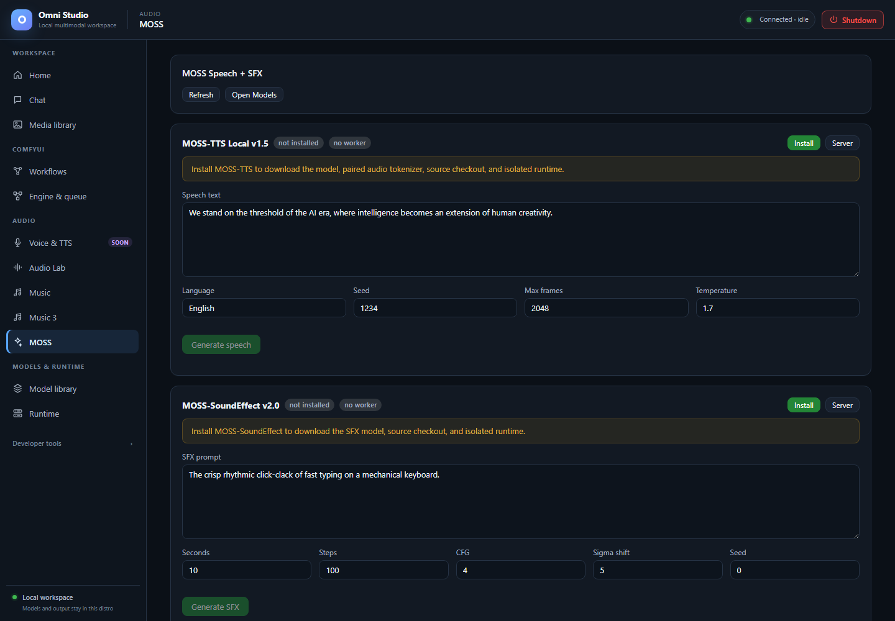

# MOSS

*Separate speech and sound-effect controls with no installed workers. The manual documents the speech decoder limitation. Captured September 25, 2026.*

**MOSS** is two local engines on one page:

- **MOSS-TTS Local v1.5** — text to speech
- **MOSS-SoundEffect v2.0** — text to sound effects

They are separate model families, separate workers, separate VRAM. Voice &
TTS (**Soon**) links here, but fresh MOSS-TTS generation is currently blocked
on the tested build. MOSS-SoundEffect remains a qualified sound-effects path.

Open **Audio → MOSS**.

**Refresh** reloads install and worker state. **Open Models** jumps to Model
library. Each engine also has a **Server** button to Runtime.

## Shared operator rules

1. Install the engine (downloads model, tokenizer/source, isolated runtime).
2. **Start worker** on an explicit GPU with enough free VRAM. MOSS is large;
   on the tested machine it did not fit a 12 GB auxiliary card and loaded on
   a 24 GB card. Generic autospawn is not capacity-aware — pick the device
   on Runtime if the one-click start lands on the wrong GPU.
3. Generate. The GUI posts for a **WAV blob** and plays it in an `<audio>`
   element. Successful API responses also persist under Omni output
   (`kind=omni`) with `X-Omni-Output-*` headers.
4. Unload/kill the worker when you need the GPU for Comfy or Music.

Do not run MOSS-TTS and ACE XL at the same time unless both APIs and host
RAM prove they fit. Schedule them sequentially by default.

## MOSS-TTS

Status row: installed badge, worker ready/starting/none, **Install** or
**Start worker**.

Banners:

- not installed — install to download the model, paired audio tokenizer,
  source checkout, and isolated runtime
- installed but no worker — start a worker before generating

Fields:

- **Speech text**
- **Language** (default English)
- **Seed**
- **Max frames** (1–7500, default 2048)
- **Temperature** (0.1–3.0, default 1.7)

**Generate speech** stays disabled until the worker is ready. The player
appears under the button.

API equivalent: `POST /api/tts/moss_tts` with `response_format: wav`. WAV is
the dependable path and is required if the gateway restimes speed.
`speed` on the API ranges 0.25–4.0. Other format names exist (`mp3`, `ogg`,
`flac`, `opus`); WAV is what this tab uses.

The output URL can be fed to ACE-Step Vocal→BGM, A2A, or Cover as
`init_audio_url`.

### TTS caution

Earlier 48 kHz speech runs succeeded on a 3090, but a fresh load followed by
inference failed in the upstream decoder with `CUDA driver error: unknown
error` and exhausted WSL `dxgresource` descriptors. Omni retires the worker
after a worker-side 5xx so poisoned CUDA state is not reused. **Do not blindly
retry or treat a ready worker as proof of working speech.** Use a previously
persisted WAV or a recorded source until a fresh run and cleanup are qualified.
Voice-cloning breadth has not been characterized.

This tab is not MiniCPM TTS and not Qwen Talker.

## MOSS-SoundEffect

Same install/start pattern for `moss_sfx`.

Fields:

- **SFX prompt** — describe one event ("crisp rhythmic click-clack of fast
  typing on a mechanical keyboard"), not a song
- **Seconds** 0.1–30 (default 10)
- **Steps** 1–200 (default 100)
- **CFG** 0–20 (default 4)
- **Sigma shift** 0–20 (default 5)
- **Seed**

**Generate SFX** posts `/api/moss/sfx` and plays the 48 kHz WAV.

VRAM estimate is about 10–12 GB; still prefer the larger GPU when the
smaller card is busy. Subjective event quality requires listening in Media
library. Hold the semantic event constant if you A/B against Audio Lab
effects; the engines do not share a latent space or seed meaning.

ACE-Step Text2Samples is **not** a third dependable SFX path (unreleased
adapter).

## After generation

1. Confirm the file in **Media library → Omni (TTS / STT)**.
2. Pin keepers.
3. Kill the exact `moss_tts` / `moss_sfx` worker on Runtime.
4. Recheck device VRAM before starting Comfy.

## Related pages

- [Voice & TTS](10-voice-and-tts.md) — why the speech hub is still Soon
- [Audio Lab](11-audio-lab.md) — alternative effects
- [Music](12-music.md) — Vocal→BGM handoff
- [Runtime](07-runtime.md)
