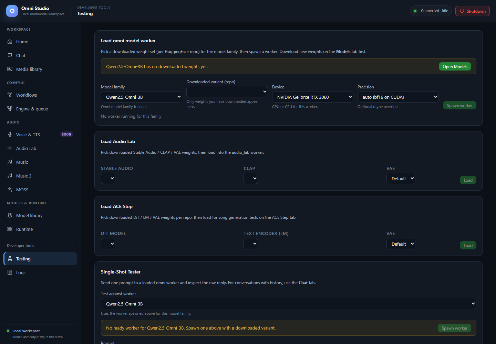

# Testing

*Developer controls for selecting installed variants and workers. Loading and inference were not performed for this capture. Captured September 25, 2026.*

**Testing** is a developer tool: load downloaded weights, then send a
**one-shot** prompt and inspect the raw reply. It is not a replacement for
Chat sessions, not a music DAW, and not a Comfy queue.

Open the sidebar **Developer tools** disclosure, then **Testing**.

Use it when you want to know "does this variant actually answer?" without
creating a 100-message session. For multi-turn work, use Chat.

## Load an Omni worker

The first card is **Load omni model worker**.

1. **Model family** — chat-capable ids. Moshi, Audio Lab, ACE-Step, MOSS-TTS,
   and MOSS-SFX are hidden here on purpose. Moshi has no batch path.
2. **Downloaded variant (repo)** — only variants you already downloaded.
   Empty list means go to Model library.
3. **Device**
4. **Precision** — auto / fp16 / bf16 / fp32
5. **Spawn worker**

Banners appear when the family has no weights or no variants. **Open
Models** jumps to Model library.

If a worker already exists for that family, the card shows its status and
variant so you do not spawn a duplicate by accident. Kill extras on Runtime.

## One-shot inference

Once a worker is ready, the prompt box, temperature, top-p, and max tokens
send a single `/api/chat/{model}` style request (non-session). The raw text
lands in the response pane. This is for contract checks (`QWEN3B_TEXT_OK`
style), not for roleplay.

Testing also has **Image**, **Audio**, and **Video** file inputs below the
prompt. It sends those files with the one-shot request, subject to the chosen
worker's actual modality support. Responses are not streamed. Qwen audio/video
and Moshi duplex remain unavailable here.

If the response is an error JSON, read it. 501 on audio/video is the honest
Qwen/MiniCPM video behavior, not a broken button.

## Audio Lab and ACE-Step loaders

Lower cards let you pick **installed** Audio Lab SA/CLAP/VAE or ACE-Step
DiT/LM/VAE (including custom: names) and load them the same way the audio
tabs do. Generate on the Audio Lab or Music tab after loading; Testing has
no Audio Lab or ACE-Step generation form.

Prefer the real Audio Lab / Music tabs for anything you want to keep. Those
tabs have progress, jobs, LoRAs, and ranked output. Testing is a smoke path.

Still obey:

- cheap state reads before load
- explicit device
- unload + delete the exact worker after the test if residency is not wanted
- ACE and Audio Lab inference is synchronous; do not poll generic jobs

## What Testing will not do

- It will not create Chat sessions or persist 24h history
- It will not queue Comfy workflows
- It will not enable Voice & TTS
- It will not make Moshi batch-infer (hidden)
- It will not bypass `valid: false` on an oversized spawn

## Related pages

- [Chat](04-chat.md)
- [Runtime](07-runtime.md)
- [Logs](16-logs.md) — if spawn hangs, watch the stream
- [Feature compatibility](21-feature-compatibility.md)
