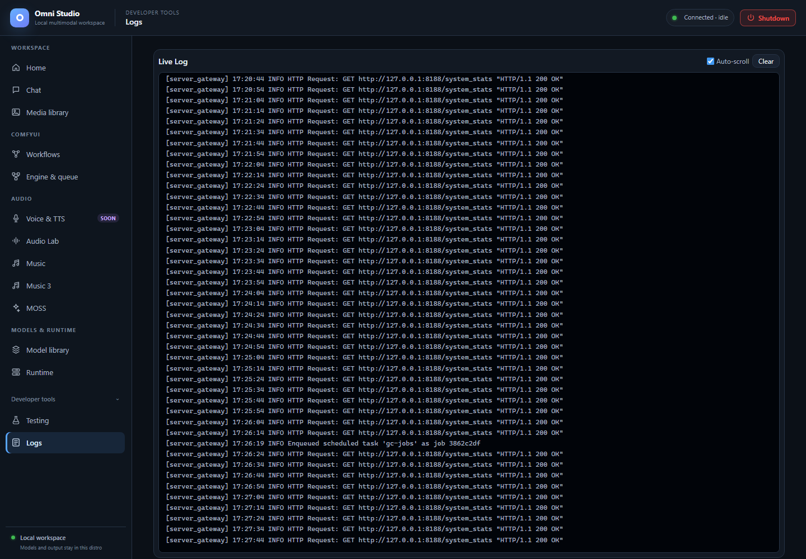

# Logs

*The actual log viewer with retained local log entries. Historical entries do not describe a currently running Comfy instance. Captured September 25, 2026.*

**Logs** is a live view of the gateway log stream. It is a developer tool,
not a job dashboard and not a substitute for worker Logs buttons on Runtime.

Open **Developer tools → Logs**.

## What you see

A **Live Log** card with:

- **Auto-scroll** checkbox (on by default)
- **Clear** — empties the on-screen buffer and the in-memory log array in
  the UI (it does not wipe Linux log files on disk)
- a monospace viewer of lines `[source] message`

The viewer is fed by an authenticated SSE endpoint (`/api/logs/stream`). The
UI keeps a bounded buffer (**500** lines). Older lines drop from the viewer
as new ones arrive. Per-client SSE queues on the server are also bounded;
a slow viewer can lose lines without affecting other clients.

Color hints (substring match on the message):

- red — `error` or `fail`
- orange — `warn`
- green — `ready`, `complete`, `success`

These colors are cosmetic. A green "ready" in one worker does not mean
Comfy is ready.

## When to open Logs

- Gateway badge sat on Connecting, then recovered — look for bind/port
  errors
- A spawn stays on starting — Python tracebacks, CUDA OOM, missing files
- An install job failed and the job Log is too short
- HuggingFace 401/403 loops
- You cancelled a job and want to see whether the worker retired

## When not to use Logs

- To follow Comfy sampling progress — use Engine & queue and `omni-cli
  comfy watch`
- To follow ACE/Audio Lab diffusion — those tabs have their own progress
  poll
- To retrieve media — Media library
- To read the Omni API token — never. If a token appears in a log line,
  treat it as a leak and rotate; this app's discipline is to keep tokens
  out of logs.

## Worker and Comfy logs

Runtime and Engine & queue **Logs** buttons fetch `GET /api/workers/{id}/logs`
and `GET /api/comfy/{id}/logs`. Those are process tails for one id. The Logs
tab is the gateway multiplex. Use both when a spawn fails: gateway line
first, then the worker tail.

CLI: `omni-cli workers logs WORKER_ID --lines 200` and
`omni-cli comfy logs INSTANCE_ID`.

## If the stream is empty

1. Confirm the gateway badge is connected.
2. Trigger a harmless action (Refresh on Runtime).
3. If still empty, the SSE may have been closed during Shutdown or a
   gateway restart; reload the UI after the badge recovers. The frontend
   reacquires the session token after 401.

## Related pages

- [Runtime](07-runtime.md)
- [Engine & queue](09-engine-and-queue.md)
- [Shutdown](17-shutdown.md)
